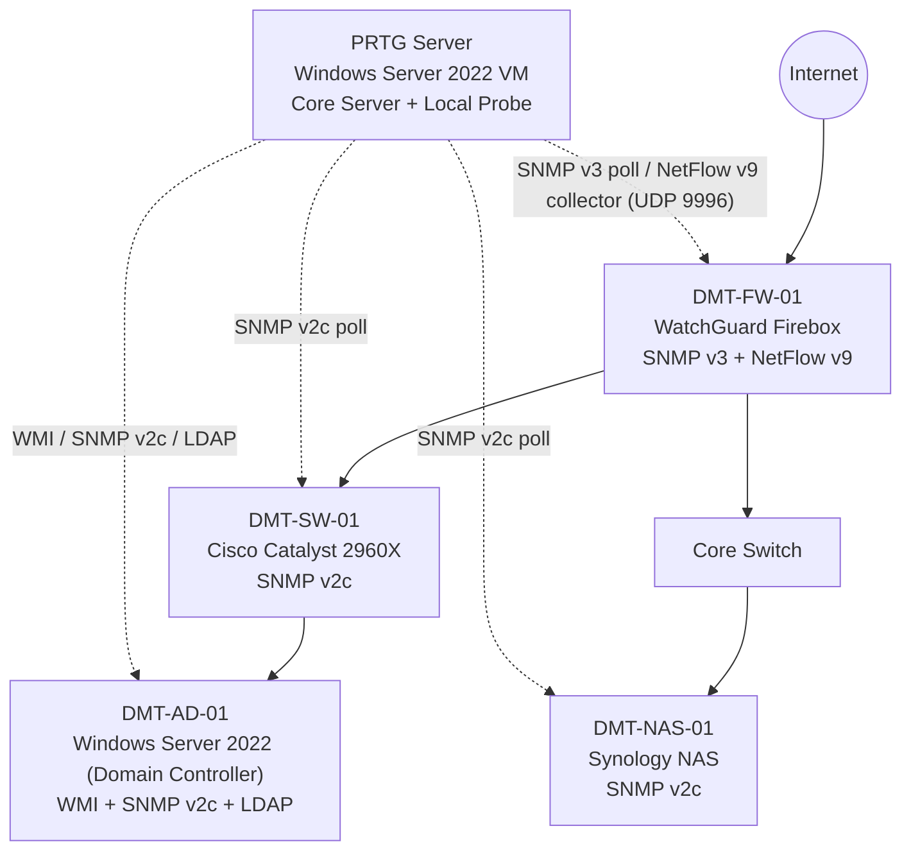

# PRTG Network Monitoring Home Lab

**End-to-end installation, hardening, and monitoring of a multi-vendor infrastructure with Paessler PRTG Network Monitor**


.


**Author:** Clinton Kehinde

---

## Overview

Imagine it is 2:00 a.m. A critical server has silently gone offline, and the first sign of trouble is an angry customer who cannot reach a service. By then the outage has already hurt the business and IT is reacting instead of preventing the problem. A monitoring platform exists to avoid exactly that situation.

This repository documents how I designed, deployed, secured, and validated a complete network monitoring environment using **PRTG Network Monitor** in my own home lab. I recorded every stage as I completed it, from installing PRTG on a Windows Server 2022 virtual machine, to monitoring a Cisco switch, a Synology NAS, a WatchGuard firewall, and a Windows Server Domain Controller with several different protocols.

The result is a working monitoring environment that tracks network performance, server health, storage utilisation, authentication services, and traffic flows in real time, and alerts me when something starts to fail.

## Architecture

The logical layout below follows the PRTG map I built in [Section 11](docs/11-maps-reports-ticketing-backup.md). Solid arrows show the network path and dotted arrows show monitoring traffic.



## Lab Environment

| Component | Specification |
|---|---|
| Host hardware | Personal home lab, Intel Core i5 (4 cores) |
| RAM | 8 GB |
| Storage | 256 GB SSD |
| Host OS | Windows 11 |
| Hypervisor | VMware Workstation (free) |
| PRTG host | Windows Server 2022 virtual machine, static IP |
| Monitoring tool | PRTG Network Monitor (Paessler) |
| Licence | Free edition (up to 100 sensors) |

## What I Built

- PRTG instance on a Windows Server 2022 VM in VMware Workstation
- Platform hardening: default credentials replaced, HTTPS enabled, notification templates reviewed, configuration backed up
- A scalable **Groups → Devices → Sensors** hierarchy that uses PRTG's settings inheritance
- Cisco Catalyst switch monitored over **SNMP v2c**, with a deliberate failure test to prove alerting works
- Synology NAS monitored over SNMP with **manually selected sensors** (system health, physical and logical disks, memory, traffic)
- WatchGuard firewall monitored over **SNMP v3** (authenticated and encrypted), with credentials inherited from the group
- **NetFlow v9** traffic analysis exported from the WatchGuard firewall to PRTG
- Windows Server monitored with **WMI and SNMP**, restricted to the PRTG server
- **Active Directory** service monitoring (LDAP, replication, Netlogon, DNS, W32Time, DFSR)
- Network maps, scheduled reports, ticketing workflow, and a layered backup strategy

## Skills Demonstrated

| Area | Evidence in this repository |
|---|---|
| Infrastructure monitoring | Multi-vendor monitoring design, sensor selection, threshold tuning, alert design |
| Network protocols | SNMP v2c and v3 (auth and privacy), MIBs and OIDs, traps, NetFlow v9, WMI, LDAP |
| Network devices | Cisco IOS CLI, WatchGuard Firebox, Synology DSM |
| Windows Server administration | Roles and features, Active Directory, services, SNMP service configuration |
| Security hardening | Credential rotation, HTTPS, read-only SNMP, host-restricted SNMP, SNMP v3, least privilege |
| Operations | Notification design, alert fatigue management, maps, reporting, ticketing, backup and restore testing |
| Documentation | Structured runbooks with verification, rationale, and production considerations |

## Monitored Devices

| Device name | Platform | Role | Protocols | PRTG group |
|---|---|---|---|---|
| PRTG server | Windows Server 2022 VM | Monitoring server | Local probe (built-in health sensors) | Local Probe |
| `DMT-SW-01` | Cisco Catalyst 2960X | Access switch | SNMP v2c | Network Infrastructure → Switching |
| `DMT-NAS-01` | Synology NAS (2 disks, RAID volume) | Storage | SNMP v2c, ICMP | Storage |
| `DMT-FW-01` | WatchGuard Firebox | Perimeter firewall | SNMP v3, NetFlow v9, ICMP | Firewalls |
| `DMT-AD-01` | Windows Server 2022 | Domain Controller, DNS | WMI, SNMP v2c, LDAP, ICMP | Servers |

**Naming convention:** `ORG-TYPE-NN`, for example `DMT-SW-01` is organisation `DMT`, device type `SW` (switch), device number `01`.

## Documentation Index

| # | Document | Topics |
|---|---|---|
| 01 | [Overview and Prerequisites](docs/01-overview-and-prerequisites.md) | Goals, the 100-sensor licensing model, requirements |
| 02 | [Installation](docs/02-installation.md) | Download, installer, Express vs Custom, service verification, first login |
| 03 | [Initial Setup and Security Hardening](docs/03-initial-setup-and-hardening.md) | Password, HTTPS, notifications, auto-update, first backup |
| 04 | [Organising Devices with Groups](docs/04-organising-devices-with-groups.md) | Grouping strategies, hierarchy, inheritance |
| 05 | [Cisco Switch with SNMP v2c](docs/05-cisco-switch-snmpv2.md) | SNMP concepts, IOS configuration, failure test |
| 06 | [Synology NAS with Manual Sensors](docs/06-synology-nas-manual-sensors.md) | DSM SNMP, Synology sensors, generic SNMP sensors |
| 07 | [WatchGuard Firewall with SNMP v3](docs/07-watchguard-firewall-snmpv3.md) | v2c vs v3, group-level credentials, sensor priorities |
| 08 | [NetFlow Traffic Analysis](docs/08-netflow-traffic-analysis.md) | Flow export, collector, Top Talkers, protocols |
| 09 | [Windows Server with WMI and SNMP](docs/09-windows-server-wmi-snmp.md) | WMI sensors, SNMP service, thresholds |
| 10 | [Windows Server Roles and Services](docs/10-windows-roles-and-services.md) | LDAP, replication, service sensors, PowerShell sensors |
| 11 | [Maps, Reports, Ticketing, and Backup](docs/11-maps-reports-ticketing-backup.md) | Dashboards, reporting, incident workflow, backup strategy |
| 12 | [Lessons Learned and Future Improvements](docs/12-lessons-learned-and-future-improvements.md) | Consolidated lessons, security review, roadmap |
| – | [Screenshot Index](docs/screenshots/README.md) | Checklist of every screenshot referenced in the docs |

## Repository Structure

```text
prtg-network-monitoring-homelab/
├── README.md
├── configs/
│   └── cisco-ios-snmp-v2c.txt
├── scripts/
│   └── Check-ServiceStatus.ps1
└── docs/
    ├── 01-overview-and-prerequisites.md
    ├── 02-installation.md
    ├── 03-initial-setup-and-hardening.md
    ├── 04-organising-devices-with-groups.md
    ├── 05-cisco-switch-snmpv2.md
    ├── 06-synology-nas-manual-sensors.md
    ├── 07-watchguard-firewall-snmpv3.md
    ├── 08-netflow-traffic-analysis.md
    ├── 09-windows-server-wmi-snmp.md
    ├── 10-windows-roles-and-services.md
    ├── 11-maps-reports-ticketing-backup.md
    ├── 12-lessons-learned-and-future-improvements.md
    └── screenshots/
        └── README.md
```

## Key Takeaways

1. **Secure the monitoring platform first.** A monitoring server holds credentials, topology, and operational data. I hardened PRTG before adding a single device.
2. **Plan the hierarchy before adding devices.** Group-level inheritance means credentials and settings are configured once and applied everywhere beneath them.
3. **Collect the right data, not all the data.** The free licence is measured in sensors, which forces deliberate choices. I deleted low-value sensors, such as static system partitions, and prioritised the important ones.
4. **Test your alerting.** I disconnected a live uplink to prove that PRTG detects, alerts, and recovers.
5. **SNMP and NetFlow complement each other.** SNMP shows how busy an interface is; NetFlow shows who and what is making it busy.
6. **Monitor services, not just servers.** A Domain Controller can have 12% CPU and still be unable to authenticate anyone if AD DS has stopped.
7. **The monitoring server is a critical service.** It needs both configuration backups and full VM backups, and the restore process must be tested.

> [!WARNING]
> **Before publishing this repository:** the lab values in these documents (SNMP community string, domain name, internal IP addresses, email addresses) are real lab values. Replace them with placeholders or rotate them if you reuse them anywhere outside the lab. Never commit real passwords. Passwords in this documentation are intentionally masked or described generically.

## Technologies

PRTG Network Monitor · Windows Server 2022 · VMware Workstation · Active Directory · Cisco IOS · WatchGuard Firebox · Synology DSM · SNMP v2c/v3 · NetFlow v9 · WMI · LDAP · PowerShell · Veeam Backup & Replication
