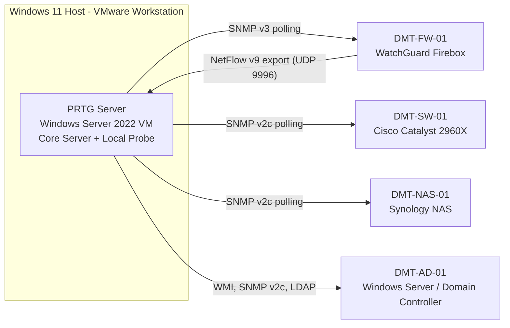
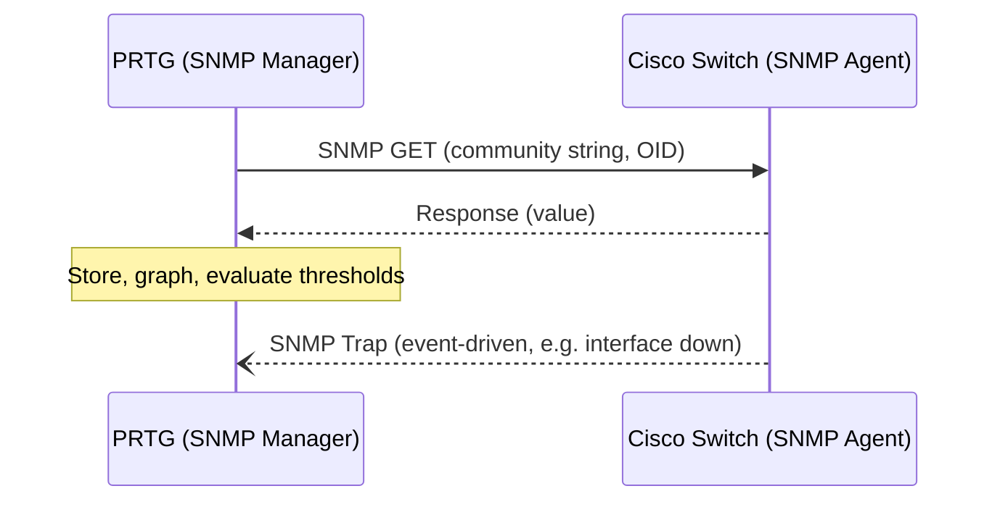
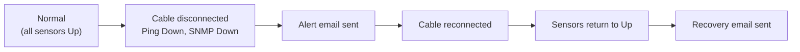
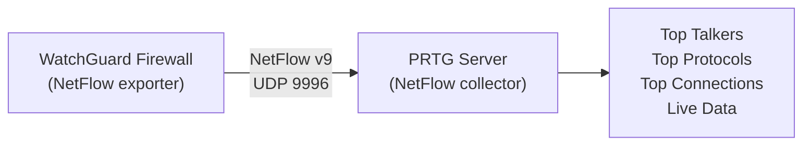
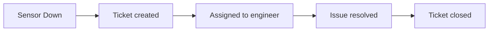

<div align="center">

# PRTG Network Monitor Home Lab

### End-to-End Installation, Hardening, and Infrastructure Monitoring

**SNMP v2c & v3 · NetFlow v9 · WMI · LDAP · Windows Role Monitoring · Maps, Reports, Ticketing & Backup**


.


**Author:** Clinton Kehinde

</div>

---

## Table of Contents

- [Project Overview](#project-overview)
- [Skills Demonstrated](#skills-demonstrated)
- [Lab Environment](#lab-environment)
- [Introduction](#introduction)
- [What I Built](#what-i-built)
- [Understanding the 100-Sensor Limit](#understanding-the-100-sensor-limit)
- [Prerequisites](#prerequisites)
- [Section 1: Downloading and Installing PRTG](#section-1-downloading-and-installing-prtg)
- [Section 2: Initial Setup and Security Hardening](#section-2-initial-setup-and-security-hardening)
- [Section 3: Organising Devices with Groups](#section-3-organising-devices-with-groups)
- [Section 4: Monitoring a Cisco Switch with SNMP v2c](#section-4-monitoring-a-cisco-switch-with-snmp-v2c)
- [Section 5: Monitoring a Synology NAS with Manual Sensors](#section-5-monitoring-a-synology-nas-with-manual-sensors)
- [Section 6: Monitoring a Firewall with SNMP v3](#section-6-monitoring-a-firewall-with-snmp-v3)
- [Section 7: NetFlow Traffic Analysis](#section-7-netflow-traffic-analysis)
- [Section 8: Monitoring Windows Servers with WMI and SNMP](#section-8-monitoring-windows-servers-with-wmi-and-snmp)
- [Section 9: Monitoring Windows Server Roles and Services](#section-9-monitoring-windows-server-roles-and-services)
- [Section 10: Maps, Reports, Ticketing, and Backup](#section-10-maps-reports-ticketing-and-backup)
- [Project Summary](#project-summary)
- [Security Considerations](#security-considerations)
- [Challenges Encountered and Solutions Implemented](#challenges-encountered-and-solutions-implemented)
- [Future Improvements](#future-improvements)

---

## Project Overview

This repository documents the design, deployment, and validation of a complete infrastructure monitoring platform built with **PRTG Network Monitor** (Paessler AG). The lab monitors a Cisco Catalyst switch, a Synology NAS, a WatchGuard firewall, and a Windows Server domain controller using the same protocols and practices found in production environments.

Every stage is documented as it was performed: installation, security hardening, logical design, protocol configuration, sensor selection, failure testing, and backup.

| Item | Detail |
|---|---|
| **Author Hardware** | Personal home lab setup |
| **CPU** | Intel Core i5, 4 cores |
| **RAM** | 8 GB |
| **Storage** | 256 GB SSD |
| **Host OS** | Windows 11 |
| **Virtualisation** | VMware Workstation (Free) |
| **Monitoring Tool** | PRTG Network Monitor (Paessler) |
| **PRTG Licence** | Free edition (up to 100 sensors) |
| **Monitoring VM OS** | Windows Server 2022 |

---

## Skills Demonstrated

| Area | Demonstrated Capability |
|---|---|
| **Network Monitoring** | PRTG deployment, sensor design, alerting, dashboards, reporting |
| **Protocols** | SNMP v2c and v3 (authPriv), NetFlow v9, WMI, LDAP |
| **Security Hardening** | Default credential removal, HTTPS enforcement, least-privilege design, SNMP access restriction, encrypted management traffic |
| **Network Devices** | Cisco IOS SNMP configuration, WatchGuard Firebox SNMP and NetFlow export |
| **Systems Administration** | Windows Server 2022, Active Directory, DNS, Windows services, SNMP Service installation |
| **Storage Monitoring** | Synology DSM SNMP, disk, RAID, and volume health |
| **Operations** | Naming conventions, group inheritance, sensor prioritisation, alert-fatigue management |
| **Resilience** | Configuration backup, VM-level backup, restore testing |
| **Documentation** | Structured, reproducible, verification-driven lab documentation |

---

## Lab Environment

### Monitored Devices

| Device Name | Role | Platform | Monitoring Method |
|---|---|---|---|
| *(PRTG host)* | Monitoring server | Windows Server 2022 VM on VMware Workstation | Local Probe, Core Server |
| `DMT-SW-01` | Access switch | Cisco Catalyst 2960X | SNMP v2c |
| `DMT-NAS-01` | Network storage | Synology NAS (DSM) | SNMP v2c with manually selected sensors |
| `DMT-FW-01` | Perimeter firewall | WatchGuard Firebox | SNMP v3 and NetFlow v9 |
| `DMT-AD-01` | Domain controller / DNS | Windows Server 2022 | WMI, SNMP v2c, LDAP, service monitors |

### Naming Convention

A consistent convention is applied to every monitored object so devices remain searchable as the environment grows.

| Segment | Meaning | Example |
|---|---|---|
| `DMT` | Organisation abbreviation | `DMT` |
| `SW` / `NAS` / `FW` / `AD` | Device type or role | `SW` = Switch |
| `01` | Device number | `01` |

### Monitoring Architecture



> 📸 **Screenshot 0.1: Lab topology**
> Capture the physical or logical lab topology (VMware network settings or a diagram) showing the PRTG VM and the monitored devices.

---

## Introduction

It is 2:00 a.m. and a critical server has silently gone offline. The first indication that something is wrong comes from an angry customer who cannot access a service. By then the outage has already affected the business and the IT team is reacting instead of preventing the problem. A monitoring solution exists to avoid exactly that situation.

Monitoring is not simply a matter of displaying graphs or collecting statistics. It provides continuous visibility into the health, performance, and availability of network devices and servers, and it alerts administrators when something begins to fail, so that issues can be investigated and resolved before users are affected.

I chose **PRTG Network Monitor**, developed by Paessler AG, for this lab. It is one of the most widely used infrastructure monitoring platforms in the industry because it combines enterprise-level capabilities with a relatively straightforward deployment. It supports SNMP, WMI, NetFlow, packet sniffing, SSH, HTTP, VMware, Hyper-V, Active Directory, SQL databases, cloud services, and many other technologies, so it can monitor almost every component found in a modern IT environment.

The free edition supports up to 100 sensors, which is more than enough to build a realistic monitoring environment while learning the platform, and it exposes many of the same monitoring techniques used in production networks.

This guide documents every stage of the deployment as I completed it. I installed PRTG on a Windows Server virtual machine in VMware Workstation, secured the installation, and then configured monitoring for a Cisco Catalyst switch, a Synology NAS, a WatchGuard firewall, and a Windows Server. Along the way I worked with SNMP v2c and v3, WMI, LDAP, and NetFlow.

All work was completed on an Intel Core i5 machine with 8 GB of RAM and a 256 GB SSD, running Windows 11, VMware Workstation, and Windows Server 2022. No enterprise hardware was required beyond the virtual infrastructure and the network devices being monitored.

The end result is a functional monitoring environment capable of tracking network performance, server health, storage utilisation, authentication services, and traffic flows in real time.

---

## What I Built

- A PRTG Network Monitor instance running on a Windows Server 2022 virtual machine in VMware Workstation.
- Initial hardening of the PRTG installation: default credentials changed, HTTPS enabled, and notification templates reviewed.
- Monitoring of a **Cisco Catalyst switch** using SNMP v2c.
- Monitoring of a **Synology NAS** using SNMP, with manually configured sensors for disk utilisation, memory usage, system health, and storage capacity.
- Monitoring of a **WatchGuard firewall** using SNMP v3 with authenticated and encrypted communication.
- **NetFlow** traffic analysis from the WatchGuard firewall into PRTG.
- Monitoring of a **Windows Server** using both WMI and SNMP.
- **Active Directory** monitoring using LDAP sensors.
- Device grouping, sensor priority management, notification configuration, and backup of the monitoring configuration.

---

## Understanding the 100-Sensor Limit

I initially assumed the free edition allowed monitoring of up to 100 *devices*. The limit is actually based on **sensors**, not devices.

A sensor represents a single monitoring metric on a device. A server monitored for CPU usage, memory utilisation, disk capacity, network traffic, and uptime is already using five sensors. The same principle applies to network equipment: monitoring every interface on a 48-port switch individually could consume more than half of the available sensors on that one device.

Understanding this changed how I planned the lab. Instead of enabling everything, I selected only the most valuable sensors for each device.

> [!NOTE]
> The free edition of PRTG includes up to 100 sensors, which is sufficient for most home labs and many small business environments. Larger deployments require a commercial licence from Paessler.

---

## Prerequisites

| # | Requirement |
|---|---|
| 1 | A computer running Windows 11 with at least an Intel Core i5 processor, 8 GB of RAM, and 256 GB of storage |
| 2 | VMware Workstation installed and functioning correctly |
| 3 | A Windows Server 2022 (or Windows Server 2025) virtual machine configured with a **static IP address** |
| 4 | Access to the official Paessler website to download the latest version of PRTG Network Monitor |
| 5 | At least one network device available for monitoring, such as a Cisco switch, Synology NAS, WatchGuard firewall, Windows Server, or another SNMP-enabled device |

---

# Section 1: Downloading and Installing PRTG

## Overview

PRTG is capable of monitoring thousands of devices, yet the installation is straightforward. Paessler has designed the setup so that administrators can get a monitoring server running quickly without working through pages of configuration.

I installed PRTG directly on my Windows Server 2022 virtual machine in VMware Workstation. Keeping the monitoring platform inside a VM keeps everything related to it in one place, which makes management, backups, and updates much easier.

## Step 1: Download the Installer

1. Log in to the Windows Server VM and open a web browser.
2. Navigate to the official Paessler website and select **Products > PRTG Network Monitor**.
3. On the download page, click **Free Download**. At the time of writing this provides a fully featured **30-day trial licence**. When the evaluation period expires, the installation automatically reverts to the free edition (up to 100 sensors). No payment information or credit card is required.
4. While the installer downloads, the website displays a unique licence key associated with the Paessler account. The installer usually detects this automatically, but I copied the key and stored it securely as a precaution. Having it available saves time if the installer later requests manual activation.


> [!NOTE]
> The installer is approximately **400 MB**. On a typical home broadband connection the download took roughly 3 to 8 minutes, depending on network speed.

> [!TIP]
> I download software directly inside the VM whenever possible. It avoids copying large installation files from the host into the guest and keeps the deployment simple.

## Step 2: Run the Installer

The installer is located in the **Downloads** folder of the Windows Server VM. The wizard requires only a few decisions.

1. Double-click the PRTG Network Monitor installer.
2. Choose a language (**English**) and click **OK**.
3. On the welcome screen, review and accept the licence agreement, then click **Next**.
4. Because the installer was downloaded while signed in to my Paessler account, it automatically detected my licence information. If this does not happen, enter the licence key shown on the download page manually.
5. Enter an email address. This becomes the **primary notification account** PRTG uses for alerts, reports, and system notifications.
6. PRTG contacts Paessler's licensing servers to validate the licence. This took approximately **15 to 30 seconds** in my environment.


## Step 3: Choose the Installation Type

PRTG offers two installation options.

| Feature | Express Installation | Custom Installation |
|---|---|---|
| Installation location | Uses the default installation directory | Allows a custom installation path |
| Device discovery | Automatically scans the network after installation | Discovery can be configured manually later |
| Configuration | Minimal user input required | Greater control over installation settings |
| Best suited for | Home labs, demonstrations, and small environments | Production environments with specific deployment requirements |

I selected **Express Installation**. My goal was a functional lab quickly, and automatic discovery would let me confirm that the monitoring server could communicate with the rest of the lab without configuring every device by hand first.

The installer copies the application files, installs the required Windows services, configures the built-in web server, and prepares the monitoring database. On my VM this took approximately **3 to 10 minutes**, depending on system performance. When it finished, PRTG created a desktop shortcut on the Windows Server.


## Step 4: Verify the PRTG Services

Before opening the web interface, I confirmed that the services responsible for running PRTG had started correctly.

1. Press **Windows + R**, type `services.msc`, and press **Enter**.
2. Locate and verify the following services.

| Service | Description | Status | Startup Type |
|---|---|---|---|
| **PRTG Core Server Service** | The main service that powers PRTG. It manages the web interface, stores monitoring data, processes alerts, generates reports, schedules sensor scans, and coordinates communication between all connected probes. | Running | Automatic |
| **PRTG Probe Service** | Performs the actual monitoring work. It polls devices, collects performance data from sensors, executes monitoring protocols such as SNMP and WMI, and sends the collected data back to the Core Server for processing and display. | Running | Automatic |


> [!NOTE]
> If either service is stopped after installation, it can usually be started by right-clicking the service and selecting **Start**.

> [!IMPORTANT]
> **Best practice:** avoid restarting PRTG services unless it is genuinely necessary. Restarting the Core Server interrupts sensor polling and can create temporary gaps in monitoring data, historical graphs, and alert processing. In production, service restarts should be performed during a planned maintenance window.

## Step 5: Log In to PRTG for the First Time

1. Double-click the **PRTG Network Monitor** desktop shortcut. The web console opens in the default browser.
2. Sign in with the default credentials:

| Field | Value |
|---|---|
| Username | `prtgadmin` |
| Password | `prtgadmin` |

3. Click **Log In**. The dashboard loads within a few moments.

Because Express Installation was selected, automatic discovery began immediately. Before I had configured anything manually, PRTG was already identifying the default gateway, DNS servers, and several virtual machines on the lab network. This confirmed that the Core Server and Probe Service were working and that the platform could communicate with devices across the environment.


### Verification

| Test | Expected Result | Actual Result | Status |
|---|---|---|---|
| PRTG Core Server Service | Running, Automatic | Running, Automatic | ✅ |
| PRTG Probe Service | Running, Automatic | Running, Automatic | ✅ |
| Web console access | Dashboard loads | Dashboard loaded | ✅ |
| Auto-discovery (Express install) | Devices begin appearing | Gateway, DNS servers, and VMs discovered | ✅ |

### Why This Matters

**Why:** installing in a VM keeps the monitoring platform portable and easy to back up or snapshot.
**What:** the installer deploys two cooperating services, the Core Server (brain, database, and web UI) and the Probe (polling engine).
**How:** the Probe runs the SNMP, WMI, and other checks and reports results to the Core Server, which stores and evaluates them.
**Production relevance:** verifying services before touching the UI is a habit that shortens troubleshooting. If the dashboard fails to load, the service state tells you immediately which component is at fault.

---

# Section 2: Initial Setup and Security Hardening

## Overview

On first login, I resisted the temptation to start adding devices. The first minutes after installing any management platform are better spent securing it than using it.

As soon as the dashboard loaded, two warning banners appeared: one reported that the **default administrator password** was still in use, and the other that the interface was being accessed over **HTTP instead of HTTPS**.

A monitoring platform holds credentials, device information, network topology, and operational data that would be extremely valuable to an attacker. I addressed every security recommendation before configuring the first monitored device.

> 📸 **Screenshot 2.1: Security warning banners**
> Show the dashboard with both banners: *"Default administrator password is still active"* and *"You are using HTTP. Please switch to HTTPS."*

## Step 1: Clean Up the Auto-Discovered Devices

Express Installation made PRTG scan the local network immediately, and within minutes it had discovered my gateway, DNS server, a Linux machine, and several other systems. I deliberately removed these entries.

The goal of this lab was to understand every configuration step rather than rely on automation. I wanted to configure each device manually so I would understand:

- how credentials are stored
- how sensors are created
- which monitoring protocol each device uses
- how PRTG communicates with different operating systems and network equipment

**Procedure:** in **Devices**, right-click each auto-discovered device I planned to configure manually, select **Delete**, and confirm.

**Devices removed**

- DNS Server
- Gateway / Firewall
- Linux Machine

**Default objects I kept** (these monitor the health of the monitoring server itself, and deleting them would only mean recreating them later)

- Local Probe
- Core Server
- Internet Connectivity sensor
- DNS Health sensor

PRTG separates its own infrastructure from the devices it monitors, which makes it easy to distinguish the monitoring platform from the monitored environment.


## Step 2: Replace the Default Administrator Password

Every new PRTG installation uses `prtgadmin` / `prtgadmin`. That is acceptable during installation because everyone starts with the same credentials, but leaving them unchanged is effectively leaving the front door unlocked: anyone who can reach the web interface already knows the administrator credentials. Changing the password was my highest priority.

**Procedure**

1. Click the username in the upper-right corner and open **Account Settings**.
2. The page shows *Login Name*, *Display Name*, *Primary Email Address*, and *Password*.
3. Enter the current password and create a new one containing uppercase letters, lowercase letters, numbers, and special characters, and longer than **fourteen characters**.
4. Confirm the password and click **Save**. The warning banner disappears immediately.


> [!IMPORTANT]
> **Production recommendation:** use **named administrator accounts** instead of shared credentials. Each engineer gets their own account, which provides complete audit logs showing who changed what, support for multi-factor authentication, easier permission management, and straightforward account removal when staff leave. A single administrator account is fine for this home lab, but named accounts would be mandatory in a real organisation.

## Step 3: Switch from HTTP to HTTPS

Although the password had been changed, PRTG was still being accessed over plain HTTP. HTTP sends data unencrypted, so usernames, passwords, cookies, session tokens, and monitoring data could be intercepted by anyone able to observe the traffic. Because a monitoring server stores credentials for switches, firewalls, Windows servers, and storage devices, protecting that traffic is essential.

**Procedure**

1. Click the HTTPS warning banner, which opens the SSL/web server configuration page.
2. Accept PRTG's offer to generate a **self-signed certificate** (acceptable here because the lab is entirely inside an isolated home environment).
3. Apply the change. PRTG restarts its internal web service.
4. When the browser reconnects, it displays a **certificate warning**. This is expected: the certificate was generated locally rather than issued by a trusted Certificate Authority, so the browser has no external authority to verify it.
5. Select **Advanced**, choose **Proceed**, and continue to the HTTPS interface.
6. Log in again with the new password. The connection is now encrypted.


> [!IMPORTANT]
> **Home lab vs production:** a self-signed certificate is fine for an internal lab. In production, replace it with a certificate from a trusted CA such as **DigiCert**, **GlobalSign**, **Let's Encrypt**, or the organisation's internal **Active Directory Certificate Services**. A trusted certificate removes browser warnings and ensures administrators are talking to the genuine server.

## Step 4: Enable Browser Notifications

The next prompt came from the browser rather than PRTG, asking whether to allow notifications. I selected **Allow**.

Email remains the primary notification method for most monitoring systems, but browser notifications add another layer of awareness. If I am working elsewhere in PRTG or in another tab, important alerts appear on the desktop without me watching the dashboard. In production this is one of several channels alongside email, SMS, Microsoft Teams, Slack, or mobile push notifications.


## Step 5: Review Notification Templates

Monitoring without notifications has very limited value. A platform should not simply collect information; its purpose is to notify administrators when something requires attention.

I navigated to:

```
Setup → Notifications
```

PRTG had already created a default email notification template using the address supplied during installation. Rather than build a new one, I reviewed how it behaved. By default it sends a notification when:

- a monitored object first goes **Down**
- the object comes back **Up**

This tells me both when a problem begins and when service has been restored.


### Production alerting design

For critical infrastructure such as domain controllers, firewalls, Internet gateways, and backup servers, I would configure **multiple notification methods simultaneously**, for example email, SMS, and push notification. Less important devices can remain email-only.

I also reviewed **alert schedules**. In this lab, notifications are enabled 24 hours a day. In a business environment, planned maintenance windows would normally suppress non-critical alerts so engineers are not flooded while performing intentional maintenance.

> [!WARNING]
> **Alert fatigue.** It is easy to create hundreds of alerts and much harder to create alerts people actually pay attention to. If every minor fluctuation generates a warning, administrators eventually stop reading them, and the one critical alert gets missed. I would rather receive ten meaningful alerts than a thousand unnecessary ones. Effective monitoring is about quality, not quantity.

## Step 6: Learn the Interface

Before adding devices, I spent several minutes exploring the interface. Knowing where information lives is almost as important as understanding the sensors.

| Section | Purpose |
|---|---|
| **Devices** | Monitored infrastructure organised into groups, devices, and sensors |
| **Sensors** | A complete list of every measurement being collected |
| **Alarms** | Active warnings and failures requiring attention |
| **Maps** | Custom dashboards and graphical network maps |
| **Reports** | Historical reports and availability statistics |
| **Logs** | Configuration changes, events, and system activity |
| **Tickets** | Built-in incident tracking and integration with external service desks |
| **Setup** | Administrative configuration for the entire platform |


## Step 7: Review Automatic Updates

I visited:

```
Setup → Auto-Update
```

PRTG can install updates automatically or manually. In the home lab I left automatic updates **enabled** because downtime affects only me.

> [!IMPORTANT]
> **Production recommendation:** use manual updates. Monitoring systems are too important to update blindly. Validate each upgrade in a lab or staging environment first. If an update introduces a bug into the monitoring platform itself, administrators lose visibility into the rest of the network precisely when they may need it most.


## Step 8: Create the First Configuration Backup

Before monitoring any device, I created my first configuration backup:

```
Setup → Administrative Tools → Save Configuration to File
```

PRTG generated a ZIP archive containing its configuration database. It took only a few moments but provided an immediate recovery point in case I misconfigured the platform later. I made a habit of creating another backup before any significant configuration change.


A configuration backup and a VM backup protect different things, and **both are required**.

| Backup Type | Protects |
|---|---|
| **PRTG configuration backup** | Device settings, sensor configuration, notification templates, historical monitoring data |
| **Virtual machine backup** | Windows operating system, installed applications, system files, registry, and recovery from hardware failure or ransomware |

Neither replaces the other. True disaster recovery depends on protecting both the application and the platform it runs on.

### Verification

| Test | Expected Result | Actual Result | Status |
|---|---|---|---|
| Default password warning | Banner removed after password change | Banner disappeared | ✅ |
| HTTPS enabled | Interface served over HTTPS after web service restart | HTTPS session established after accepting the self-signed certificate | ✅ |
| Notification template | Email on Down and Up events | Default template confirmed (Down / Up) | ✅ |
| Configuration backup | ZIP archive created | ZIP archive generated | ✅ |

### Key Reflection

Spending time securing PRTG before adding devices was one of the best decisions I made. A monitoring platform holds sensitive information about the entire network, and securing it properly means I can trust it to protect and monitor everything else.

### What I Achieved in Section 2

- Removed auto-discovered devices to learn manual configuration
- Replaced the default administrator password
- Enabled HTTPS for encrypted access
- Enabled browser notifications
- Reviewed notification templates
- Explored the PRTG interface
- Checked auto-update settings
- Created the first configuration backup

---

# Section 3: Organising Devices with Groups

## Overview

Before adding the first monitored device, I planned how to organise the environment. It is tempting to start adding switches, servers, firewalls, and storage as soon as PRTG is installed, but a few extra minutes of planning at the start saves a great deal of time later.

PRTG organises everything in a clear hierarchy:

```
Groups → Devices → Sensors
```

Every object inherits settings from the level above it.

- A **group** can contain multiple devices.
- Each **device** can contain dozens or even hundreds of sensors.
- Settings such as credentials, scanning intervals, notification templates, and SNMP configuration can all be **inherited automatically**.

Rather than configuring every device individually, a setting can be configured once at the appropriate level and every child object inherits it. As the environment grows this dramatically reduces administrative effort and keeps configuration consistent.

A modest network of fifty devices can contain several hundred sensors. Without a logical structure, finding a particular server or switch during an outage becomes frustrating and troubleshooting takes longer than it should.

## Grouping Strategies

There is no single correct way to organise devices; the right structure depends on the environment. These are the strategies that appear repeatedly in production deployments.

| Strategy | Description | Best Suited For | Example |
|---|---|---|---|
| **By Function** | Devices grouped by what they do rather than where they are | Small to medium organisations with one IT team | Network Infrastructure, Servers, Storage, Firewalls, Wireless, Virtualisation |
| **By Location** | Infrastructure separated by physical office or geography | Large organisations with multiple sites | London, Manchester, Birmingham, Edinburgh, or New York, Chicago, Dallas |
| **By Technology** | Devices grouped by vendor or platform | Organisations with specialist teams | Cisco, VMware, Microsoft Windows, Linux, NetApp, Synology |
| **By Criticality** | Devices grouped by business importance | Environments where alert prioritisation matters more than device type | Tier 1 (Critical), Tier 2 (Important), Tier 3 (Lower priority) |
| **Hybrid** | Combines two or more strategies | Large enterprises with complex requirements | Site, then function (see below) |

**Criticality tiers in detail**

| Tier | Description | Examples |
|---|---|---|
| Tier 1 | Mission-critical systems | Internet firewalls, Domain Controllers, core switches, storage arrays |
| Tier 2 | Important business systems | Departmental application servers, print servers, backup infrastructure |
| Tier 3 | Lower-priority equipment | Lab devices, development systems, test environments |

**Hybrid example**

```
London
 ├── Network
 ├── Servers
 └── Storage
Manchester
 ├── Network
 ├── Servers
 └── Storage
```

This scales well because administrators can drill down by both location and function.

## Choosing the Structure for This Lab

The lab is a single-site environment managed by one person, so I organised **by function**. Similar devices sit together and are easy to locate, compare, and manage.

```
Local Probe
│
├── Network Infrastructure
│   └── Switching
│
├── Servers
│
├── Storage
│
└── Firewalls
```

The hierarchy leaves room for future expansion. If I later monitor wireless access points, routers, VMware hosts, backup servers, or cloud infrastructure, I can add groups without reorganising anything.

## Creating the Group Structure

1. From **Devices**, locate the **Local Probe**, which is the root of the monitoring tree. Every monitored object ultimately belongs beneath it.
2. Right-click **Local Probe** and select **Add Group**.
3. Name the first group `Network Infrastructure`.
4. When PRTG asks whether to start auto-discovery, leave it **disabled**. I wanted to add every device manually so I understood how each protocol was configured.
5. Repeat the process to create three more top-level groups:
   - `Servers`
   - `Storage`
   - `Firewalls`
6. Right-click **Network Infrastructure**, select **Add Group**, and create the subgroup `Switching`. This is where the Cisco Catalyst switch is added in Section 4.

Not every network device performs the same role. Some route, some switch, and others provide wireless connectivity, so a subgroup for switching equipment reflects that. Further subgroups such as **Routing**, **Wireless**, **Load Balancers**, **WAN**, and **VPN Appliances** can be created as the lab evolves.


## Understanding Inheritance

Inheritance lets child objects receive settings from their parent group. If every Cisco switch in an organisation uses the same SNMP community string, there is no need to enter it for every device. It can be configured **once at the Switching group level**, and every switch placed in that group inherits it. Ten additional switches added later would immediately use the same settings with no extra work.

Settings that can be inherited include:

- scanning intervals
- credentials
- notification templates
- schedules
- dependency settings
- security options

This dramatically reduces repetitive work and ensures consistency. It may not seem exciting at first, but it becomes extremely valuable when hundreds or thousands of devices are monitored.


## Best Practices and Pitfalls

| Do | Avoid |
|---|---|
| Plan the structure before adding devices | Adding devices without a plan |
| Use meaningful, consistent naming conventions | Generic names like "Group 1" or "New Devices" |
| Leverage inheritance to avoid repeated configuration | Duplicating settings instead of using inheritance |
| Keep groups balanced (too many small groups is messy, too few is hard to navigate) | Ignoring alerts from unorganised or misplaced devices |
| Review and adjust the structure as the environment grows | Over-engineering the structure for very small environments |

## What I Learned

Before this lab I assumed groups were simply folders used to keep the interface tidy. Groups are in fact the foundation on which the monitoring platform is built. A well-designed structure improves navigation, reduces configuration time through inheritance, simplifies future expansion, and makes troubleshooting significantly easier during an outage.

---

# Section 4: Monitoring a Cisco Switch with SNMP v2c

## Overview

Adding the Cisco switch was the first time I connected a real network device to PRTG. Until now I had focused on installing, securing, and organising the platform itself. This section begins collecting live operational data.

I started with a Cisco Catalyst switch because it is one of the most common devices in enterprise networks. Switches connect users, servers, printers, wireless access points, and many other devices. If a switch fails, the impact can range from one disconnected workstation to an entire building losing connectivity.

**Objectives**

- Poll the switch every 60 seconds
- Track availability, uptime, processor utilisation, memory usage, hardware health, and interface traffic
- Alert immediately if the switch becomes unreachable or a critical hardware component fails

## Understanding SNMP

SNMP (Simple Network Management Protocol) is one of the most important protocols in network administration. Almost every enterprise-grade device supports it, including routers, switches, firewalls, wireless controllers, printers, storage arrays, UPS systems, environmental sensors, and many IoT devices.

SNMP follows a **manager-agent model**:

- The monitoring server (PRTG) is the **SNMP Manager**.
- Each monitored device runs an **SNMP Agent**.
- At regular intervals the manager asks the agent questions such as: *What is your CPU usage? How much memory are you using? How long have you been running? Which interfaces are active? Are the cooling fans normal? Has a power supply failed?*
- The device responds with the current value for each metric.

PRTG stores these values in its database, builds historical graphs, compares them to thresholds, and raises alerts when something falls outside expected behaviour. I think of SNMP as a routine health check: rather than waiting for a patient to collapse, PRTG performs check-ups every minute so warning signs are seen before they become outages.



### Key SNMP Concepts

**Object Identifier (OID).** Every measurable value on an SNMP-enabled device has a unique numeric address, much like a file path that points to a specific piece of information inside the device. For example:

```
1.3.6.1.2.1.1.3.0
```

represents the **system uptime** on almost every SNMP-capable device. Thousands of other OIDs exist for CPU utilisation, interface traffic, memory usage, fan status, power supply health, temperature, and vendor-specific features.

**Management Information Base (MIB).** Remembering long numeric OIDs would be nearly impossible, so manufacturers publish MIBs, which act as a dictionary that translates OIDs into names. Instead of `1.3.6.1.2.1.1.3.0`, the monitoring software understands "System Uptime". Cisco, Synology, WatchGuard, Dell, HP, and many other vendors publish MIBs for both standard and vendor-specific values.

**Community strings.** SNMP v2c has no usernames or passwords; authentication uses a **community string**, which functions like a shared password. If the string matches, the device responds. If it does not, the device ignores the request. I configured **Read-Only (RO)** access, so PRTG can read from the switch but cannot change its configuration. This is best practice because monitoring systems rarely need write access.

**SNMP traps.** Everything above describes *polling*: every 60 seconds PRTG asks the switch for information. SNMP also supports *traps*, where the device sends a message immediately when an important event occurs (interface failure, power supply fault, fan failure, excessive temperature, device reboot). Polling provides continuous monitoring and traps provide immediate notification. Using both together is more responsive.

## Step 1: Configure SNMP on the Cisco Switch

I connected to the Cisco Catalyst 2960X over **SSH**, entered privileged EXEC mode, and then global configuration mode.

```cisco
Switch> enable
Switch# configure terminal

! Configure a read-only SNMP community
Switch(config)# snmp-server community danmilltraining RO

! Enable SNMP trap generation
Switch(config)# snmp-server enable traps

! Optional but useful administrative information
Switch(config)# snmp-server contact lab-admin@corp.local
Switch(config)# snmp-server location Home Lab - Switch Rack

Switch(config)# end

Switch# copy running-config startup-config
```

| Command | Purpose |
|---|---|
| `snmp-server community danmilltraining RO` | Defines the community string PRTG will use and restricts it to **read-only** access |
| `snmp-server enable traps` | Allows the switch to send event-driven SNMP notifications |
| `snmp-server contact` / `snmp-server location` | Optional inventory metadata that helps identify the device later |
| `copy running-config startup-config` | Saves the configuration so SNMP survives a reboot |

Surprisingly little configuration was required. The switch was now ready to answer SNMP queries, and the community string would be used by PRTG to authenticate every polling request.


> [!WARNING]
> Many devices ship with default community strings such as `public` and `private`. These values are widely known and must never be used in production. Anyone who knows the community string can query the device. The community string used in this lab is a lab-only value and is not reused anywhere else.

> [!IMPORTANT]
> **Production recommendation:** also configure an SNMP **access list** that limits requests to the IP address of the PRTG server. Even if someone discovered the community string, the switch would ignore requests from any other source. Prefer SNMP v3 wherever the device supports it (see [Section 6](#section-6-monitoring-a-firewall-with-snmp-v3)).

## Step 2: Add the Switch to PRTG

With SNMP enabled, I returned to PRTG and navigated to:

```
Devices → Network Infrastructure → Switching
```

Inside the **Switching** group, right-click and select **Add Device**, then provide the following:

| Setting | Value |
|---|---|
| Device Name | `DMT-SW-01` |
| IP Version | IPv4 |
| IP Address | Switch management IP address |
| Device Icon | Cisco |
| SNMP: Inherit from Parent | Disabled (configured individually for learning purposes) |
| SNMP Version | SNMP v2c |
| Community String | `danmilltraining` |
| UDP Port | 161 |
| Timeout | 5 seconds |
| Auto-discovery | Disabled temporarily (triggered manually after the device is configured) |

The device name follows the lab convention: **DMT** (organisation) · **SW** (device type: switch) · **01** (device number).

After clicking **OK**, the switch appeared beneath the Switching group.


## Step 3: Run Auto-Discovery

I right-clicked the switch and selected **Run Auto-Discovery**. PRTG queried the switch via SNMP, analysed which metrics were available, and after about **one to two minutes** populated a set of recommended sensors:

| Sensor | Purpose |
|---|---|
| **Ping** | Verifies the device is reachable |
| **SNMP System Uptime** | Shows how long the switch has run since its last reboot |
| **SNMP CPU Load** | Tracks processor utilisation over time |
| **SNMP Memory** | Tracks memory utilisation over time |
| **Fan Health** | Monitors hardware (fan) status |
| **Interface Traffic** | Created automatically for every active port, allowing per-connection traffic monitoring |
| **SSL Certificate** | Monitors the certificate presented by the device |


> [!NOTE]
> Interface sensors count toward the 100-sensor limit. On a larger switch, keep only the uplinks and critical ports. See [Understanding the 100-Sensor Limit](#understanding-the-100-sensor-limit).

## Step 4: Explore the Monitoring Data

To see how PRTG presents information, I opened the **SNMP CPU Load** sensor. The sensor page shows far more than a single percentage:

- the **current value** (real-time CPU utilisation) at the top
- a **historical graph** of the previous 24 hours
- a **Live Data** tab with a larger interactive graph, where I can zoom into specific periods to see when usage rose and how long spikes lasted

This history is one of PRTG's greatest strengths. If someone reports that "the network was slow yesterday afternoon," I no longer have to guess. I can examine CPU utilisation, interface traffic, memory usage, and uptime for that exact period and determine whether the switch was under unusual load. Troubleshooting is based on objective evidence rather than opinion.


## Step 5: Test the Monitoring System

A monitoring system is only useful if it actually detects failures, so rather than assume it worked, I ran a controlled failure test.

1. I **disconnected the network cable** connecting the switch to the firewall.
2. I waited approximately one polling cycle.
3. The device icon turned **red**, the Ping sensor reported complete packet loss, and every SNMP sensor changed state because PRTG could no longer reach the SNMP agent.
4. An **email notification** arrived stating that the device was unavailable.
5. I **reconnected the cable**.
6. After another polling cycle every sensor returned to a healthy green state, and a **second email** confirmed that the switch had recovered.



### Verification

| Test | Expected Result | Actual Result | Status |
|---|---|---|---|
| SNMP polling of the switch | Sensors populate with data | CPU, memory, uptime, fan, and interface data collected | ✅ |
| Cable disconnected | Device and sensors go Down | Device icon red, Ping showed 100% loss, SNMP sensors Down | ✅ |
| Down notification | Email alert received | Email received | ✅ |
| Cable reconnected | Sensors return to Up | All sensors returned to green | ✅ |
| Recovery notification | Email received | Second email received | ✅ |


### Why This Matters

**Why:** a configuration that has never been tested is an assumption. A deliberate outage proves both detection and alerting work end to end.
**What:** it validated the SNMP configuration, the PRTG sensors, the notification template, and the email delivery path.
**How:** removing the physical link makes both ICMP and SNMP polls fail, which moves sensors to Down and triggers the Down notification. Restoring the link returns them to Up and triggers the recovery notification.
**Production relevance:** this is the shift from reacting to problems after users report them to detecting issues before users realise anything is wrong. In production the same test would be run in a maintenance window.

## What I Learned

This section gave me my first practical experience with SNMP and showed why it remains the foundation of network monitoring. Configuring SNMP on a Cisco switch takes surprisingly little effort, yet it unlocks a large amount of operational visibility. The biggest lesson was verification: by simulating a failure I confirmed the platform detects outages, alerts, and recognises recovery. From this point I was not just monitoring the network, I was actively verifying that the monitoring system itself could be trusted.

---

# Section 5: Monitoring a Synology NAS with Manual Sensors

## Overview

For the Synology NAS I deliberately did not use auto-discovery. It is useful and saves time, but I wanted to understand exactly what I was monitoring and why each sensor mattered, so I added each sensor manually. This turned out to be one of the most educational parts of the lab. It showed which metrics SNMP exposes and which are genuinely useful in production, and it reinforced the principle that good monitoring is about collecting the *right* data, not as much as possible.

## Why a NAS Should Be Monitored

A NAS often holds shared company files, departmental documents, VM backups, surveillance footage, or user home folders.

- If a switch fails, users may temporarily lose connectivity.
- If a router fails, users may lose internet access.
- If a storage device fails without warning, an organisation can lose years of business data.

Monitoring storage is about spotting warning signs long before they become disasters. The questions I wanted PRTG to answer were:

- Are the hard drives healthy?
- Are any disks beginning to overheat?
- Is the RAID array healthy?
- Is memory usage becoming excessive?
- Is the NAS becoming unreachable?
- Is network traffic unusually high?
- Is storage capacity approaching its limit?

These questions determined the sensors I configured.

## Step 1: Enable SNMP on the Synology NAS

Unlike Cisco IOS, where SNMP is configured from the command line, Synology DiskStation Manager (DSM) provides a graphical interface.

1. Open a browser, enter the NAS IP address, and log in to **DSM** with an administrator account.
2. Navigate to:

   ```
   Control Panel → Terminal & SNMP → SNMP
   ```

3. In the **SNMP** tab, configure:
   1. Tick **Enable SNMP Service**.
   2. Select **SNMP Version: SNMPv2c**.
   3. Enter the community string: `danmilltraining`
   4. Click **Apply**.

> [!IMPORTANT]
> The community string must match exactly the value PRTG will use. A single incorrect character causes every SNMP request to fail.


> [!NOTE]
> **Reflection:** Synology exposes SNMP through a GUI, whereas Cisco requires IOS commands. The interface is easier but the underlying protocol is identical.

## Step 2: Create the Storage Group and Add the Device

A dedicated group keeps storage devices organised. In PRTG:

1. Right-click **Local Probe**.
2. Select **Add Group**.
3. Name the group `Storage`.
4. Disable auto-discovery.
5. Click **OK**.

Then add the NAS inside that group:

| Setting | Value |
|---|---|
| Device Name | `DMT-NAS-01` |
| IP Version | IPv4 |
| IP Address | NAS management IP |
| Device Icon | Generic Storage (no Synology-specific icon is available, and the generic icon keeps the device recognisable in the tree) |
| SNMP: Inherit from Parent | Disabled |
| SNMP Version | SNMP v2c |
| Community String | `danmilltraining` |

Click **OK**. The NAS appears in the Storage group, ready for monitoring.


## Step 3: Add Synology-Specific Sensors Manually

Instead of running auto-discovery, I clicked **Add Sensor**. I wanted complete control over each metric. Searching for `Synology` returned several sensors designed specifically for Synology hardware.


### Synology System Health

An overall health dashboard for the NAS. Rather than a single component, it combines several hardware checks:

- overall system status
- fan health
- power supply status
- system temperature
- hard drive condition

If any component reports a problem, the sensor changes from green to warning or error. It provides an at-a-glance overview before I investigate detailed metrics.

### Synology Physical Disk

PRTG asks which physical drives to monitor. The NAS has two disks, so I selected both. Each disk reports:

- operational status
- temperature
- health
- read/write condition

Hard drives rarely fail instantly. They usually show subtle warning signs first: temperature gradually increases, SMART health values change, and read errors become more frequent. Monitoring those trends lets an engineer replace a drive before users notice a problem.

### Synology Logical Disk

Users do not interact with physical disks, they interact with logical volumes built on RAID arrays. This sensor reports:

- RAID health
- available capacity
- used capacity
- overall logical volume status

If the RAID array degrades because of a failed disk, this sensor alerts immediately.


## Step 4: Add Generic SNMP Sensors

Synology-specific sensors are excellent, but I also wanted resources that exist on almost every network device.

**SNMP Memory.** I searched for `SNMP Memory` and selected:

- Physical Memory
- Virtual Memory
- Swap Space

After the first polling cycle PRTG began graphing memory utilisation. Watching usage over time is more useful than a single percentage. If memory slowly climbs every day without dropping, it could indicate a memory leak, runaway processes, insufficient RAM, or a poorly performing application. Historical trends are often more valuable than snapshots.

**Ping.** The most basic sensor and arguably the most important. If the NAS stops responding to ICMP, something fundamental has happened: it may be powered off, disconnected, experiencing a network failure, or completely crashed. Every other sensor depends on the device being reachable first.

**SNMP Traffic** (for the NAS network interface). It measures:

- inbound bandwidth
- outbound bandwidth
- utilisation
- historical traffic patterns

This makes abnormal behaviour visible. If a backup job suddenly begins transferring hundreds of gigabytes during business hours, the graph shows exactly when the spike occurred.

### Sensor Summary

| Sensor | Type | What It Detects |
|---|---|---|
| Synology System Health | Synology SNMP | Overall hardware status, fans, power, temperature, disks |
| Synology Physical Disk (x2) | Synology SNMP | Per-disk status, temperature, health |
| Synology Logical Disk | Synology SNMP | RAID health, capacity, volume status |
| SNMP Memory | Generic SNMP | Physical, virtual, and swap memory trends |
| Ping | ICMP | Reachability |
| SNMP Traffic | Generic SNMP | Inbound and outbound bandwidth, utilisation |


## Step 5: Verify the Sensors

After a few polling cycles every sensor changed to a healthy **green** status. That tells me two things immediately:

- PRTG can communicate with the NAS.
- The SNMP configuration is correct.

I opened the **Physical Disk** sensor to explore the data. It shows disk status, current temperature, historical temperature graphs, and long-term health trends. Plotting temperature over time is the point: if a drive slowly rises from 34 °C to 49 °C over several weeks, I would notice the trend long before the hardware fails. That is what proactive monitoring is designed to achieve.

### Verification

| Test | Expected Result | Actual Result | Status |
|---|---|---|---|
| SNMP v2c connectivity to NAS | Sensors return data | All sensors populated | ✅ |
| Community string match | No SNMP timeouts | No errors; sensors green | ✅ |
| Physical Disk sensors | Both disks reported | Disk 1 and Disk 2 reporting status and temperature | ✅ |
| Logical Disk sensor | RAID/volume status reported | Volume status and capacity reported | ✅ |
| Overall sensor state | All Up | All sensors green after a few polling cycles | ✅ |


### Why This Matters

**Why:** storage failures cause data loss, not just downtime, so storage deserves deeper monitoring than a ping check.
**What:** manual selection produced a focused set of sensors covering drive health, RAID state, memory, reachability, and traffic.
**How:** the Synology MIB exposes disk, volume, and system health through SNMP, and PRTG's Synology sensors translate those values into status and graphs.
**Production relevance:** selecting sensors deliberately keeps sensor counts (and licensing cost) under control, and trend data supports proactive disk replacement and capacity planning.

## What I Learned

I used to assume monitoring meant checking whether a device was online. Building each sensor by hand showed me that effective monitoring identifies subtle warning signs before they become outages. A healthy NAS is not just one that answers pings; it is one whose disks stay cool, whose RAID array stays healthy, whose memory usage is stable, and whose traffic follows expected patterns. The biggest lesson was the value of historical data: current status shows how a device is performing now, while graphs over days or weeks show whether it is getting healthier or drifting toward failure.

---

# Section 6: Monitoring a Firewall with SNMP v3

## Overview

Up to this point every monitored device used SNMP v2c. It worked well, was simple to configure, and was adequate for a home lab. A production firewall, however, is the device responsible for protecting an entire network, and monitoring it calls for a more secure approach. That is where **SNMP v3** becomes essential.

SNMP v2c relies on a community string sent without encryption. SNMP v3 introduces proper **authentication** and **encryption**: it verifies that the monitoring server is authorised to request information, and it protects the monitoring traffic itself from being intercepted or read. This matters especially for firewalls, which expose information about interfaces, VPNs, CPU usage, memory consumption, and traffic patterns that could be valuable to an attacker. Protecting that information is as important as monitoring it.

This was my first practical experience configuring secure SNMP communications, and it reinforced that security should be built into management protocols rather than added afterwards.

## SNMP v2c vs SNMP v3

| Feature | SNMP v2c | SNMP v3 |
|---|---|---|
| Authentication | Community string (plaintext) | Username with authentication password |
| Encryption | None | DES, AES-128, or AES-256 (device dependent) |
| Security | Low | High |
| Credentials | Single community string | Username, authentication password, and encryption password |
| Best use | Home labs and trusted internal networks | Production environments and security-critical devices |

With v2c, anyone who discovers the community string can query the device. With v3, an attacker would need the **username**, the **authentication password**, and the **encryption password**, and would still be unable to read the traffic because it is encrypted.

> [!IMPORTANT]
> **Best practice:** SNMP v1 should never be used. SNMP v2c is acceptable only inside trusted internal environments. For routers, firewalls, VPN concentrators, or any security-sensitive infrastructure, SNMP v3 should always be the preferred choice.

## Step 1: Configure SNMP v3 on the WatchGuard Firewall

I logged in to the WatchGuard Firebox management interface and navigated to:

```
System → SNMP
```

I enabled SNMP, selected **Version 3**, and created a dedicated monitoring account.

| Setting | Configuration |
|---|---|
| Username | `snmpv3user` |
| Authentication Protocol | SHA-1 |
| Authentication Password | Strong unique password |
| Privacy Protocol | DES |
| Privacy Password | Different strong password |

SNMP v3 separates **authentication** from **encryption**. The authentication password proves *who I am*; the privacy password *encrypts the communication itself*. Using different passwords for the two purposes improves overall security.

> [!WARNING]
> DES was the only encryption option available on the WatchGuard appliance in my lab. Many enterprise devices now support **AES-128 or AES-256**, which are significantly stronger and should always be chosen when available. DES and SHA-1 are legacy algorithms and are listed under Future Improvements.

After creating the user, I configured **SNMP traps** so the firewall can proactively send important events to the monitoring server the moment they occur, rather than waiting for PRTG's 60-second poll. I set the **trap destination** to the IP address of the PRTG server and saved the configuration.


> [!NOTE]
> **Reflection:** the interface differs between vendors (Cisco, Palo Alto, Fortinet, WatchGuard) but the concepts are almost identical. Every platform asks for an SNMP username, authentication protocol, authentication password, encryption protocol, encryption password, and the monitoring server's IP address. Learning those concepts is more valuable than memorising any one vendor's UI.

## Step 2: Configure SNMP v3 at the Group Level in PRTG

PRTG's inheritance model lets credentials be configured once at group level and inherited by every device inside it.

1. Right-click **Local Probe** and select **Add Group**.
2. Name the group `Firewalls` and disable auto-discovery.
3. Open the group settings and scroll to **Credentials for SNMP Devices**.
4. **Disable Inherit from Parent**, because the default credentials are configured for SNMP v2.
5. Enter the SNMP v3 settings:

| Setting | Value |
|---|---|
| Version | SNMP v3 |
| Authentication | SHA |
| Username | `snmpv3user` |
| Authentication Password | The configured password |
| Encryption | DES |
| Encryption Key | The privacy password |

6. Click **Save**.

Every future firewall placed in this group inherits these credentials. With twenty firewalls, a changed SNMP password would need updating once at group level rather than on twenty individual devices, which reduces effort and the risk of configuration errors.


## Step 3: Add the WatchGuard Firewall

Inside the **Firewalls** group, select **Add Device**:

| Setting | Value |
|---|---|
| Device Name | `DMT-FW-01` |
| IP Version | IPv4 |
| IP Address | WatchGuard management IP |
| Device Icon | WatchGuard firewall icon |

Because the SNMP credentials are inherited from the parent group, they did not need to be entered again. This confirmed the inheritance model worked as intended.


## Step 4: Run Auto-Discovery

WatchGuard devices are well supported, and PRTG already understands many of the metrics they expose, so for this device I used auto-discovery instead of manual selection. I right-clicked the firewall and selected **Run Auto-Discovery**. Over a few minutes PRTG queried the firewall's MIB and added a comprehensive set of sensors:

- Ping
- CPU Usage
- Memory Usage
- Interface Traffic
- Disk Free sensors
- System Uptime

The interface traffic sensors became immediately useful. Each interface shows separate graphs for inbound bandwidth, outbound bandwidth, and utilisation over time. When troubleshooting a slow internet connection, these graphs quickly show whether the WAN interface is saturated or another interface is carrying unusually heavy traffic.


## Step 5: Review the Sensors

| Sensor | What It Shows | What a Problem Could Indicate |
|---|---|---|
| **Ping** | Reachability; the foundation for everything else. If Ping fails, every other sensor eventually errors because PRTG cannot reach the firewall | Firewall down, link failure, upstream outage |
| **CPU Usage** | Processor utilisation over time | Spikes may point to heavy VPN traffic, denial-of-service attacks, excessive logging, or overloaded firewall policies |
| **Memory Usage** | Memory consumption over time | Steady decline over days or weeks without recovery may indicate a memory leak or other software issue |
| **Interface Traffic** | Inbound, outbound, and utilisation per interface | WAN saturation or unusual traffic on another interface |
| **Disk Free** | Free space per filesystem | See below |

PRTG created several **Disk Free** sensors. Because the WatchGuard operating system is Linux-based, each filesystem mount point appears separately, and some are system partitions that rarely change. Monitoring all of them would consume sensors without operational value, so I **deleted the partitions that were not useful** and kept only those relevant to ongoing monitoring. Good monitoring is not about collecting everything; it is about collecting information that supports decisions.


## Step 6: Understand and Assign Sensor Priorities

PRTG assigns each sensor a **priority** shown as stars. I first assumed this was cosmetic, but the documentation shows priorities influence which sensors get the most visibility across the dashboard. I prioritised sensors by operational importance.

| Sensor | Priority | Reason |
|---|---|---|
| Ping | ★★★★★ | If this fails, everything else fails |
| CPU Usage | ★★★★★ | High CPU can impact performance during an incident |
| Primary WAN Interface | ★★★★★ | Critical for WAN connectivity |
| Trusted LAN Interface | ★★★★★ | Most important LAN segment |
| Memory Usage | ★★★★☆ | Important but not as critical |
| Disk Free (Volume 1) | ★★★★☆ | Monitors capacity trends |
| Other / secondary Disk Free sensors | ★★★☆☆ | Lower importance |

During an incident, the most important information naturally rises to the top instead of being buried among dozens of sensors.


### Verification

| Test | Expected Result | Actual Result | Status |
|---|---|---|---|
| SNMP v3 authenticated and encrypted polling | Sensors return data using inherited credentials | Auto-discovery completed and sensors populated | ✅ |
| Credential inheritance | Device uses group credentials without re-entry | No credentials needed on the device | ✅ |
| Auto-discovery | Ping, CPU, memory, interface, disk, uptime sensors created | All created | ✅ |
| Sensor clean-up | Unneeded Disk Free sensors removed | Non-essential partitions deleted | ✅ |

## Security Best Practices Applied and Planned

- Use long, unique authentication and privacy passwords.
- Never reuse SNMP credentials across unrelated environments.
- Restrict SNMP access so only the PRTG server can communicate with monitored devices.
- Choose **SHA** instead of MD5 whenever authentication options are available.
- Choose **AES** instead of DES whenever the hardware supports it.
- Review SNMP users periodically and remove unused accounts.
- Keep both monitoring software and firewall firmware fully updated.

These measures reduce the attack surface while still allowing PRTG to do its job.

### Why This Matters

**Why:** a firewall's management data reveals network structure and capacity, so the monitoring channel must be protected.
**What:** SNMP v3 provides authentication (SHA) and privacy (DES), and group-level inheritance centralises credentials.
**How:** PRTG authenticates as `snmpv3user`, encrypts SNMP messages with the privacy key, and the firewall only answers a validated user.
**Production relevance:** this is the standard approach for edge devices. The lab used DES because it was the only option on the appliance; production would use AES.

## What I Learned

Monitoring is not just about visibility, it is also about protecting that visibility. Configuring SNMP v3 showed me how the protocol evolved to address the weaknesses of its earlier versions. The biggest lesson was balancing usability with security: v3 is undeniably more complex than v2c, with usernames, authentication methods, encryption settings, and multiple passwords, but that complexity is justified on devices at the network edge. Configuring credentials at group level also showed how small design decisions become large time savers as environments grow.

---

# Section 7: NetFlow Traffic Analysis

## Overview

After configuring SNMP there was still one question I could not answer. PRTG could tell me whether a device was online, how busy its CPU was, and how much bandwidth passed through an interface, but not **who was using that bandwidth**. If the WAN interface suddenly hit 95% utilisation, SNMP could not say whether the cause was a Windows update, a file backup, someone streaming video, or malicious activity.

**NetFlow** solves this. It provides visibility into the *conversations* on the network: which devices are communicating, which applications they use, how much bandwidth each conversation consumes, and how patterns change over time. It turns troubleshooting from educated guesswork into evidence-based investigation.

## Understanding NetFlow

NetFlow was originally developed by Cisco to give administrators detailed insight into network traffic without capturing every packet. Instead of recording every packet like Wireshark, NetFlow summarises traffic into **flows**, which makes it efficient for continuous monitoring.

| Concept | Description |
|---|---|
| **Flow** | A conversation between two devices. Packets belong to the same flow when they share source IP, destination IP, protocol, source port, and destination port. A laptop copying files from the Synology NAS over SMB is a single flow, recorded as a summary instead of thousands of individual packets |
| **Flow Export** | Network devices periodically package flow summaries and send them to a monitoring server. The exporter can be a router, firewall, or Layer 3 switch. In this lab the **WatchGuard firewall** exports |
| **Collector** | The server that receives exported flow records, stores them, and converts them into graphs, reports, and dashboards. In this lab the **PRTG server** is the collector |
| **Top Talkers** | Answers *which devices are consuming the most bandwidth?* A workstation suddenly transferring hundreds of gigabytes is identified almost immediately |
| **Top Protocols** | Categorises traffic by protocol (HTTPS, SMB, DNS, FTP, SSH, VPN, and so on), so 500 Mbps crossing the WAN is explained by what it consists of |



### Why NetFlow Version 9?

Several NetFlow versions exist. I used **Version 9**, which compared to Version 5 adds IPv6 support, extensible templates, support for additional traffic information, and better compatibility with modern devices. Most current enterprise equipment supports v9, although some older hardware may still require v5.

## Step 1: Configure NetFlow on the WatchGuard Firewall

In the WatchGuard management interface I navigated to:

```
System → NetFlow
```

I enabled NetFlow, selected **Version 9**, and configured the collector.

| Setting | Value |
|---|---|
| NetFlow Version | 9 |
| Collector Address | IP address of the PRTG server |
| Collector Port | UDP 9996 |
| Active Flow Timeout | 1 minute |

The collector address tells the firewall where to send exports, and the collector port must match the port PRTG will listen on later.

I also configured which traffic is exported:

- traffic **generated by** the firewall itself
- traffic **destined for** the firewall

These flows are management traffic rather than user traffic, but they can provide useful security information if unusual activity occurs.

Finally I selected the interfaces that export flows. I chose the **external WAN interface** because I wanted visibility into internet traffic entering and leaving the network, and enabled both **Ingress** (incoming) and **Egress** (outgoing) before saving.

| Interface | Ingress | Egress |
|---|---|---|
| External (WAN) | ✅ | ✅ |


> [!NOTE]
> **Reflection:** enabling NetFlow does not noticeably affect firewall operation. The firewall continues forwarding packets exactly as before and simply exports metadata describing those packets in the background.

## Step 2: Add the NetFlow Sensor in PRTG

Inside the `DMT-FW-01` device I selected **Add Sensor**, searched for `NetFlow`, and since the firewall exports v9, chose **NetFlow v9**.

| Setting | Value |
|---|---|
| UDP Listening Port | 9996 |
| Sender IP | WatchGuard Firewall |
| Receiving Interface | PRTG Server LAN interface |
| Flow Timeout | 1 minute |
| Filter (initial setup) | None (collect all) |

> [!IMPORTANT]
> The UDP port and sender IP must match the firewall configuration. If either is wrong, PRTG simply will not receive any flow information, and there will be no error telling you why.

I left filtering disabled initially so I could collect every flow and understand the overall traffic profile before narrowing my focus. After clicking **Create**, the sensor entered a **Waiting for Data** state until the first exported flows arrived.


## Step 3: Verify That NetFlow Is Working

After roughly one minute the sensor began receiving data. Several views became available.

| View | What It Shows | Observation in the Lab |
|---|---|---|
| **Top Protocols** | Protocols consuming bandwidth | The majority of traffic was HTTPS, HTTP, and DNS, which matches the lab's activity (web browsing and software updates). I could now see what was generating the bandwidth |
| **Top Talkers** | Devices ranked by bandwidth consumption | PRTG automatically identified the busiest systems, so there is no need to ask each user what they were doing |
| **Top Connections** | Individual conversations: source IP, destination IP, protocol, bandwidth | A live summary of communication across the monitored interface |
| **Live Data** | Continuously updating graphs broken down by protocol | Unlike SNMP graphs (which show only utilisation), NetFlow graphs split traffic by protocol and give a clearer picture of normal behaviour. That baseline makes unusual patterns obvious |


### Verification

| Test | Expected Result | Actual Result | Status |
|---|---|---|---|
| Firewall exports NetFlow v9 to collector | Flow records sent to UDP 9996 | Sensor began receiving data after about one minute | ✅ |
| Sensor leaves *Waiting for Data* | Sensor reaches OK | Sensor OK | ✅ |
| Top Protocols populated | Protocol breakdown shown | HTTPS, HTTP, DNS dominant | ✅ |
| Top Talkers populated | Devices ranked by usage | Busiest systems identified | ✅ |

## A Practical Troubleshooting Scenario

A user phones the IT department and says: *"The internet is really slow today."*

**Without NetFlow** I would check firewall CPU, interface utilisation, ISP connectivity, and switch performance, and might eventually find the cause.

**With NetFlow** I can often answer the question in under a minute:

1. Check **Top Talkers**. If one workstation is uploading a 200 GB backup to cloud storage, it appears at the top.
2. Drill into **Top Connections** to see the specific conversations responsible.
3. Identify the **protocol** (for example HTTPS).
4. Confirm the **source device**.
5. Take action.

Instead of troubleshooting blindly, I am following objective evidence.

## NetFlow Best Practices

| Practice | Rationale |
|---|---|
| **Choose an appropriate export interval** | An active flow timeout of one minute gives near real-time visibility without overwhelming the collector. Exporting every thirty seconds gives more detail but doubles the volume of flow records |
| **Monitor the correct interfaces** | For internet analysis, export from the WAN interface. To analyse communication between internal departments, monitor the uplinks on a core Layer 3 switch. The observation point matters as much as enabling NetFlow |
| **Protect flow data** | Traditional NetFlow exports are **not encrypted**. They contain no payloads but still reveal communication patterns, so keep exports on trusted internal networks and never send them across the public internet without additional protection |
| **Review trends regularly** | Reviewing Top Talkers and protocol distributions weekly establishes a baseline of normal behaviour, which makes unusual traffic easier to recognise |
| **Ensure sufficient storage** | Make sure PRTG has enough storage for long-term flow data |
| **Use v9 where possible** | Better visibility and compatibility |

## What I Learned

I used to think monitoring bandwidth meant measuring how much traffic crossed an interface. NetFlow showed that bandwidth alone tells only part of the story. Exporting flow data to PRTG gave me visibility into the conversations on the network: which devices consumed the most bandwidth, which applications were responsible, and how patterns changed through the day. The key lesson is that **SNMP and NetFlow complement each other**: SNMP tells me how busy a device or interface is, while NetFlow explains *why* it is busy.

---

# Section 8: Monitoring Windows Servers with WMI and SNMP

## Overview

Windows servers are where PRTG really demonstrates its value. Unlike switches, routers, and firewalls, which are primarily monitored through SNMP, Windows servers expose health data through multiple methods. The two most common are **WMI** and **SNMP**.

- **WMI (Windows Management Instrumentation)** is Microsoft's native management framework and gives deep insight into the operating system: Windows services, Active Directory, Event Logs, Windows Update status, memory utilisation, disk performance, page file usage, and more, none of which SNMP exposes.
- **SNMP** is platform independent. It provides standard hardware statistics such as uptime, CPU, interface traffic, and memory. It is less detailed on Windows but works as an excellent secondary method and lets Windows servers be monitored the same way as routers, switches, and storage appliances.

I configured **both**. WMI provides rich OS monitoring and SNMP provides a vendor-neutral backup source. If one method has problems, the other keeps collecting data.

## WMI vs SNMP

| Feature | WMI | SNMP |
|---|---|---|
| Authentication | Windows or Active Directory credentials | Community string (v2c) or username/password (v3) |
| Installation | Built into Windows | Requires the SNMP feature to be installed |
| Level of detail | Extremely detailed | General system statistics |
| Windows services | Yes | No |
| Event logs | Yes | No |
| Windows updates | Yes | No |
| CPU & memory | Yes | Yes |
| Network traffic | Yes | Yes |
| Best use | Windows servers | Network devices and baseline monitoring |

- Use **WMI** whenever monitoring Windows-specific functionality.
- Use **SNMP** for standard hardware metrics or devices that do not support WMI.

In production, most administrators use WMI as the primary method for Windows servers and SNMP as a supplementary source.

## Step 1: Add the Windows Server to PRTG

Using the groups from Section 3:

1. Open **Devices**.
2. Navigate to the **Servers** group.
3. Right-click **Servers** and choose **Add Device**.

| Setting | Value |
|---|---|
| Device Name | `DMT-AD-01` |
| IPv4 Address | `192.168.1.222` (or whichever static IP is assigned to the server) |
| Device Icon | Windows Server |

The name follows the convention: **DMT** (organisation) · **AD** (Active Directory role) · **01** (first server of this type). In organisations with hundreds or thousands of monitored devices, clear naming makes searching, reporting, and troubleshooting significantly easier.

> [!IMPORTANT]
> Servers should always use **static IP addresses**. Monitoring depends on predictable connectivity.

PRTG includes several Windows Server icons. Assigning the correct icon is cosmetic but makes the tree easier to scan.

### Configure Windows Credentials

In the device settings, scroll to **Credentials for Windows Systems**. Devices inherit credentials from their parent group by default. I **disabled inheritance** so I could specify exactly which credentials PRTG should use.

| Field | Value |
|---|---|
| Domain | `corp.danieltraining.com` |
| Username | `administrator` |
| Password | *(masked)* |

Click **OK**.

> 📸 **Screenshot 8.1: Add Device (DMT-AD-01)**
> Show the Add Device form with the Servers group, name, IP, Windows Server icon, and the *Credentials for Windows Systems* section (inheritance disabled). **Mask the password.**

#### Why PRTG needs Windows credentials

Unlike SNMP, WMI performs **authenticated remote management**. When PRTG queries CPU utilisation or Windows Update status, it is effectively asking Windows itself, and Windows requires an account with sufficient permissions.

> [!WARNING]
> For this lab I used the built-in **Administrator** account because it already has the required privileges. This is **not** best practice in production.
>
> **Production recommendation:** create a dedicated service account such as `svc_prtg` and grant it only the permissions needed for monitoring. This follows the **Principle of Least Privilege** and limits the impact if the account is ever compromised.

## Step 2: Add a WMI CPU Sensor

1. Select `DMT-AD-01`.
2. Click **Add Sensor**.
3. Filter by:
   - **Target System:** Windows
   - **Technology:** WMI
4. Select **WMI CPU Load**.
5. Click **Create**.

Within about one polling interval (60 seconds by default), the sensor begins displaying CPU utilisation. Internally, PRTG queries the Windows `Win32_Processor` WMI class and retrieves the current CPU usage. The sensor displays:

- current CPU percentage
- historical graphs
- minimum and maximum values
- average utilisation
- sensor availability

Over time this graph becomes extremely valuable. If users report the server was slow yesterday afternoon, I can review the CPU graph for that period instead of guessing.

> 📸 **Screenshot 8.2: WMI CPU Load sensor**
> Show the sensor page with the gauge, graph, and channel list (Total, per-core values).

## Step 3: Use Recommended Sensors

Rather than manually searching hundreds of sensor types, I used PRTG's **Recommended Sensors** feature, which analyses the device and suggests appropriate monitoring options.

```
Add Sensor → Recommended Sensors
```

PRTG performs a quick scan of the server and returns a list. For this Active Directory server it suggested:

- Ping
- WMI Memory
- WMI Disk Free
- WMI Page File
- WMI Uptime
- WMI Network Adapter
- WMI Physical Disk
- DNS (WMI)
- Windows Update Status

I ticked each sensor and clicked **Add Selected**. Within a few minutes the server began building a complete health profile.

> 📸 **Screenshot 8.3: Recommended Sensors**
> Show the Recommended Sensors list for `DMT-AD-01` with the sensors ticked and the **Add Selected** button.

### Why Each Sensor Matters

| Sensor | Purpose and Rationale | Thresholds Used |
|---|---|---|
| **Ping** | The most basic health check. If Ping fails, every other monitoring protocol will almost certainly fail too, so it is usually the first indication that something has gone wrong | n/a |
| **WMI Memory** | Memory shortages often cause performance problems long before CPU is overloaded. As RAM fills, Windows begins moving memory pages to disk (paging), which is dramatically slower than physical memory and makes applications sluggish | Warning: **85%** · Critical: **95%** |
| **WMI Disk Free** | Windows needs free space for updates, temporary files, page file growth, event logs, and Active Directory database operations. A full system drive can render the server unstable | Warning: **20% free** · Critical: **10% free** |
| **WMI Page File** | Shows whether Windows is relying heavily on virtual memory. High page file usage combined with high RAM utilisation usually means more physical memory is required | n/a |
| **WMI Physical Disk** | Measures storage *performance* rather than capacity: read latency, write latency, queue length, and disk utilisation. High values may indicate overloaded storage, failing disks, or excessive application activity | n/a |
| **WMI Network Adapter** | Monitors throughput, errors, and discarded packets, helping identify network congestion or failing adapters | n/a |
| **DNS (WMI)** | The server hosts DNS, so the service itself must be monitored. If DNS fails, users cannot resolve hostnames, Active Directory authentication fails, and many applications stop. A healthy server with a failed DNS service is still a major outage | n/a |
| **Windows Update Status** | Arguably one of the most valuable sensors from a security standpoint. PRTG continuously checks whether important updates remain uninstalled, and alerts when update compliance drops below the desired standard instead of relying on monthly manual audits | n/a |

## Step 4: Install the SNMP Service on Windows

Although WMI provides excellent monitoring, I also wanted SNMP enabled. Windows does not install SNMP by default.

On the server:

```
Server Manager → Manage → Add Roles and Features → Features → SNMP Service
```

Tick the feature and click **Install**. After installation completes, open the Services console:

```
services.msc
```

Locate **SNMP Service** and open **Properties**.

> 📸 **Screenshot 8.4: Add Roles and Features: SNMP Service**
> Show the Features page of the wizard with **SNMP Service** ticked.

> 📸 **Screenshot 8.5: SNMP Service running**
> Show `services.msc` with the SNMP Service *Running* and *Automatic*.

### Configure the Agent Tab

The Agent tab holds optional documentation. These values have no effect on monitoring but provide useful inventory information.

| Field | Value |
|---|---|
| Contact | `lab-admin@corp.local` |
| Location | `Home Lab – Primary Server` |

### Configure the Traps Tab

PRTG primarily polls devices, but Windows can also send SNMP traps.

| Field | Value |
|---|---|
| Community | `danmilltraining` |
| Trap Destination | `192.168.1.100` (the PRTG server) |

### Configure the Security Tab

Under **Accepted Community Names**:

| Community | Rights |
|---|---|
| `danmilltraining` | **READ ONLY** |

Read-only access ensures PRTG cannot modify the server configuration through SNMP.

Then restrict who may query the service: select **Accept SNMP packets from these hosts** and add only:

```
192.168.1.100
```

This prevents any other device from querying the server through SNMP.

> 📸 **Screenshot 8.6: SNMP Service properties (Agent, Traps, Security tabs)**
> Show each of the three tabs configured as above, including *Accept SNMP packets from these hosts*.

> [!IMPORTANT]
> Restricting SNMP to the PRTG server is an access-control measure that compensates for the weakness of v2c community strings. It should be applied to every SNMP v2c device where the platform supports it.

## Step 5: Configure SNMP Credentials in PRTG

Back in PRTG:

```
DMT-AD-01 → Edit → Credentials for SNMP Devices
```

1. Disable inheritance.
2. Set **Version** to `SNMP v2c`.
3. Set **Community** to `danmilltraining`.
4. Click **OK**.

> 📸 **Screenshot 8.7: SNMP credentials on DMT-AD-01**
> Show *Credentials for SNMP Devices* with inheritance disabled, SNMP v2c, community string, and port 161.

## Step 6: Add an SNMP System Uptime Sensor

```
Add Sensor → SNMP System Uptime → Create
```

Within the next polling cycle PRTG begins reporting the server's uptime **independently of WMI**, providing a second verification source. If the server restarts unexpectedly overnight, the uptime resets and can trigger an alert. Many administrators configure notifications when uptime falls below **two hours** outside scheduled maintenance windows, so unplanned reboots are detected almost immediately.

> 📸 **Screenshot 8.8: SNMP System Uptime sensor**
> Show the sensor page with the uptime graph and current value.

## Step 7: The Most Important Windows Sensors

| Sensor | Why It Matters |
|---|---|
| Ping | Confirms the server is reachable. Usually the first indication of an outage |
| WMI CPU Load | Sustained utilisation above 80–85% indicates the processor may be overloaded |
| WMI Memory | Detects RAM exhaustion before applications slow dramatically |
| WMI Disk Free | Prevents operating system instability caused by full system drives |
| WMI Physical Disk | Reveals storage bottlenecks through latency and queue-length measurements |
| WMI Network Adapter | Identifies packet loss, interface errors, and abnormal network utilisation |
| WMI Page File | Highlights excessive paging, usually indicating insufficient physical memory |
| WMI Windows Update | Ensures security updates remain current and compliance is maintained |
| WMI Uptime | Detects unexpected reboots and confirms stability over time |
| SNMP System Uptime | Independent validation of uptime using SNMP, providing redundancy if WMI becomes unavailable |

> 📸 **Screenshot 8.9: DMT-AD-01 sensor overview**
> Show the full sensor list for `DMT-AD-01`, all in the Up state.

### Verification

| Test | Expected Result | Actual Result | Status |
|---|---|---|---|
| WMI authentication with domain credentials | Sensors return data | WMI CPU Load began reporting within one polling interval | ✅ |
| Recommended sensors | Sensors created and polling | Ping, memory, disk, page file, uptime, adapter, physical disk, DNS, and Windows Update sensors added | ✅ |
| SNMP Service installed and running | Service Running | Service running and configured | ✅ |
| SNMP restricted to PRTG host | Only `192.168.1.100` accepted | Configured under *Accept SNMP packets from these hosts* | ✅ |
| SNMP System Uptime sensor | Uptime reported independently of WMI | Reported within the next polling cycle | ✅ |

### Why This Matters

**Why:** a server can answer pings while suffering from CPU saturation, memory exhaustion, failing disks, stalled services, or missing patches.
**What:** WMI supplies OS-level depth; SNMP supplies independent, vendor-neutral baseline data.
**How:** PRTG authenticates with Windows credentials to query WMI classes such as `Win32_Processor`, and queries the Windows SNMP agent using the read-only community string from a single trusted host.
**Production relevance:** redundant data sources, least-privilege service accounts, restricted SNMP access, and meaningful thresholds turn monitoring from reactive into proactive.

## What I Learned

Effective server monitoring goes far beyond checking whether a machine is online. Combining WMI's deep OS visibility with SNMP's standardised hardware monitoring produced a more complete and resilient solution. I also reinforced the importance of dedicated service accounts, restricting SNMP to trusted hosts, and setting meaningful alert thresholds.

---

# Section 9: Monitoring Windows Server Roles and Services

## Overview

So far I have monitored the health of the server itself: CPU utilisation, memory, disk capacity, network traffic, and availability. Those metrics show whether the operating system is working. A healthy operating system does not necessarily mean the **services running on it** are healthy.

This is where many new administrators make a critical mistake. They build monitoring that says whether a server is *alive*, but not whether the business applications it hosts are *working*. Users do not care that a server's CPU sits at 18%. They care whether they can:

- log in to their computers
- access shared folders
- browse company websites
- send email
- connect to databases
- authenticate to business applications

Those capabilities are provided by **server roles and services**, not by the operating system itself. Monitoring roles is as important as, and often more important than, monitoring hardware performance.

## Why Role Monitoring Matters

Imagine it is 8:47 on Monday morning and the company's domain controller looks perfect in PRTG:

| Metric | Value |
|---|---|
| CPU usage | 12% |
| Memory usage | 48% |
| Disk space | 74% free |
| Network adapter | Healthy |
| Ping | Successful |

Every infrastructure metric is green, yet the **Active Directory Domain Services (AD DS)** service has unexpectedly crashed. Within minutes:

- employees arrive and try to log in
- Windows cannot authenticate their credentials
- Group Policy no longer applies
- file shares become inaccessible
- applications that depend on Active Directory stop working
- the helpdesk phones ring continuously

From the operating system's perspective nothing is wrong. From the users' perspective the whole organisation is offline. Without service monitoring, IT learns of the outage from users. With it, PRTG detects the failure the moment the service stops and sends an alert. That difference separates reactive IT from proactive IT.

## Understanding Windows Server Roles

Windows Server is modular: administrators install only the roles they need.

| Server Role | Purpose |
|---|---|
| Active Directory Domain Services (AD DS) | Authenticates users and computers |
| DNS Server | Resolves computer names into IP addresses |
| DHCP Server | Automatically assigns IP addresses |
| File Services | Provides network file shares |
| Print Services | Hosts shared printers |
| IIS (Internet Information Services) | Hosts websites and web applications |
| Hyper-V | Runs virtual machines |
| Certificate Services | Issues digital certificates |
| Remote Desktop Services | Provides remote application access |
| Windows Deployment Services | Deploys Windows operating systems |

Each role consists of one or more Windows services. If those services stop, the role stops functioning even though Windows itself keeps running. PRTG can monitor each service individually.

## Step 1: Add an LDAP Sensor for Active Directory

Because `DMT-AD-01` is a domain controller, Active Directory is the first role to monitor. PRTG provides an **LDAP Directory Services** sensor for this. Instead of merely checking whether TCP port 389 is open, it performs an actual **LDAP query** against the directory, verifying that Active Directory can respond to authentication requests.

1. Select `DMT-AD-01`.
2. Click **Add Sensor**.
3. Search for `LDAP`.
4. Select **LDAP Directory Services**.
5. Click **Add**.

### Configure the Sensor

| Setting | Value | Notes |
|---|---|---|
| Distinguished Name | `DC=corp,DC=danieltraining,DC=com` | The root of the Active Directory tree; the starting point where LDAP begins searching |
| Username | `administrator@corp.danieltraining.com` | |
| Password | Domain administrator password | |
| Port | `389` | Default LDAP port. For secure LDAP (LDAPS), port **636** would be used |
| Timeout | 60 seconds | |

Click **Create**.

> 📸 **Screenshot 9.1: Add LDAP Directory Services sensor**
> Show the sensor configuration form with DN, username, port 389, and timeout 60. **Mask the password.**

### What Happens During Polling

Every polling interval (typically once per minute) PRTG performs an LDAP query against Active Directory. The sensor verifies that:

- LDAP is accepting connections
- the supplied credentials authenticate successfully
- Active Directory responds correctly
- directory queries complete within the configured timeout

If any step fails the sensor immediately changes to a warning or error state. This gives far greater confidence than checking whether the server responds to ping.

> [!WARNING]
> LDAP on port 389 transmits data unencrypted by default. In production, use **LDAPS (port 636)** and a dedicated service account rather than the domain administrator.

## Step 2: Monitor Active Directory Replication

Most enterprises do not rely on a single domain controller. They deploy several across buildings, offices, or regions, and those controllers must continuously replicate with each other. Whenever a user changes a password, a new user is created, a computer joins the domain, or a Group Policy is updated, that change must replicate successfully.

If replication fails, controllers hold different information, causing confusing problems such as:

- users can log in from one office but not another
- password changes only work intermittently
- Group Policy updates never apply
- new accounts disappear
- DNS records become inconsistent

These issues can stay hidden for weeks. Monitoring replication prevents that.

1. Click **Add Sensor**.
2. Search for `Active Directory`.
3. Select **WMI Active Directory Replication Errors**.
4. Click **Create**.

> [!NOTE]
> The lab contains only one domain controller, so this sensor has little activity because there are no replication partners. In production environments with multiple domain controllers it is one of the most valuable sensors available.

> 📸 **Screenshot 9.2: WMI Active Directory Replication Errors sensor**
> Show the sensor created on `DMT-AD-01`.

## Step 3: Monitor Critical Windows Services

Roles are built from Windows services, and PRTG can alert the instant an important one stops.

1. Click **Add Sensor**.
2. Search for `Windows Service`.
3. Select **WMI Service Monitor**.

After connecting to the server, PRTG retrieves the list of installed services. I selected those essential to this environment:

| Service | Why It Is Monitored |
|---|---|
| **DNS Server** | Converts hostnames to IP addresses. Without DNS, websites fail, applications cannot locate servers, and Active Directory begins experiencing authentication problems. The server stays online but users perceive the network as unavailable |
| **Netlogon** | Handles communication between computers and domain controllers: authenticating users, locating domain controllers, establishing secure channels, and processing domain logons. If it stops, users cannot authenticate |
| **Windows Time (W32Time)** | Kerberos, the authentication protocol used by Active Directory, requires closely synchronised clocks. Even a five-minute difference between systems can cause authentication failures |
| **DFS Replication (DFSR)** | Keeps the SYSVOL folder (Group Policies, login scripts, domain-wide configuration files) synchronised between domain controllers. If replication stops, different controllers may deliver different Group Policies |

After selecting the services, click **Create**. Each service becomes an independent sensor reporting **Running**, **Stopped**, **Warning**, or **Error**. If one stops unexpectedly, PRTG generates an alert identifying the affected server, the exact service, and the time of failure, so the engineer knows where to begin troubleshooting instead of investigating the entire server.

> 📸 **Screenshot 9.3: WMI Service Monitor selection**
> Show the service list with DNS Server, Netlogon, Windows Time, and DFS Replication ticked.

> 📸 **Screenshot 9.4: Service sensors**
> Show the four service sensors in the *Running* / Up state.

## Step 4: Explore Other Role-Specific Sensors

PRTG includes a wide range of built-in sensors for common Microsoft workloads. These were reviewed in the sensor library; they are not all deployed in the lab.

| Sensor / Workload | Capability |
|---|---|
| **DNS Sensor** | Performs actual DNS lookups rather than only checking that the service runs. Verifies forward lookups, reverse lookups, response times, and specific DNS records, which confirms DNS works from an end-user perspective |
| **Microsoft Exchange** | For on-premises Exchange: mailbox databases, database mount status, replication health, mail queues, Outlook Web Access, transport services |
| **IIS Web Server** | HTTP response codes, page response times, concurrent connections, application pools, website availability, so web application issues are detected before customers report them |
| **Microsoft SQL Server** | Database availability, backup status, replication, query performance, transaction log growth, storage utilisation |
| **Hyper-V** | Virtual machine health, replication status, checkpoint age, CPU allocation, memory allocation, storage usage |
| **RDP** | Verifies that Remote Desktop connections can actually be established. Responding to ping does not guarantee administrators can remote in |
| **RADIUS** | Authentication response times, request failures, and server availability, valuable in wireless and VPN environments |
| **Windows Update Status** | Checks for missing security and important updates and patch compliance |
| **Certificate Sensor** | Alerts when SSL/TLS certificates are nearing expiration |

## Step 5: Custom Monitoring with PowerShell

Eventually every administrator needs to monitor something no built-in sensor covers. PRTG supports **custom PowerShell sensors**, one of its most powerful capabilities.

**Workflow**

1. Write a PowerShell script.
2. The script checks something specific.
3. The script returns an exit value.
4. PRTG reads that result.
5. PRTG generates graphs and alerts automatically.

**Example use cases:** Hyper-V replication status, VPN tunnel availability, Azure AD synchronisation, Microsoft 365 connectivity, SharePoint availability, SQL backup completion, application log errors, disk encryption status, certificate expiry, and third-party application health. If PowerShell can retrieve the information, PRTG can usually monitor it.

A simple script might return:

| Exit Code | Meaning |
|---|---|
| `0` | Healthy |
| `1` | Warning |
| `2` | Critical |

An illustrative example (monitoring the Print Spooler service) following this pattern:

```powershell
$service = Get-Service -Name 'Spooler'

if ($service.Status -eq 'Running') {
    Write-Output 'OK - Spooler is running'
    exit 0
}
elseif ($service.Status -eq 'Stopped') {
    Write-Output 'CRITICAL - Spooler stopped'
    exit 2
}
else {
    Write-Output 'WARNING - Spooler paused'
    exit 1
}
```

PRTG treats the result like any built-in sensor, complete with graphs, historical reports, and alert notifications. The platform can therefore grow with the organisation rather than being limited to predefined sensor types.

> 📸 **Screenshot 9.5: Custom PowerShell sensor**
> (Optional) Show a custom script sensor and its result in PRTG if you built one.

### Verification

| Test | Expected Result | Actual Result | Status |
|---|---|---|---|
| LDAP Directory Services sensor | Successful LDAP query and authentication | Sensor created and polling | ✅ |
| AD Replication Errors sensor | Sensor created | Created; low activity in a single-DC lab, as expected | ✅ |
| Service monitors (DNS, Netlogon, W32Time, DFSR) | Each reports *Running* | Each service became an independent sensor | ✅ |

### Why This Matters

**Why:** users experience services, not CPU graphs. A server can be perfectly healthy at the OS level while a critical role is down.
**What:** LDAP, replication, and service sensors monitor the identity infrastructure itself.
**How:** the LDAP sensor performs a real directory query; the WMI Service Monitor queries service state through WMI; PowerShell sensors map script exit codes to sensor states.
**Production relevance:** service-level alerts identify the failing component immediately, which shortens mean time to resolution and shifts the team from reacting to preventing.

## What I Learned

Monitoring hardware resources alone is only one part of a healthy environment. A server can have low CPU, plenty of memory, and ample disk space while still failing to deliver the services users depend on. By monitoring Active Directory, DNS, Windows services, and replication health, I moved from monitoring infrastructure to monitoring **business functionality**. Custom PowerShell sensors showed me that virtually any operational check can become an automated health monitor.

---

# Section 10: Maps, Reports, Ticketing, and Backup

## Overview

By this point the monitoring environment is fully operational. PRTG collects data from the switch, Windows servers, firewall, and NAS, and I can view graphs, receive alerts, and track infrastructure health.

Collecting data is not enough. A monitoring platform becomes genuinely valuable when it helps teams understand what is happening quickly, communicate that to others, respond to incidents efficiently, and recover if something goes wrong. This final section covers four features that turn PRTG from a set of sensors into a complete monitoring platform:

- **Network Maps** for visual monitoring
- **Reports** for documentation and long-term planning
- **Ticketing** for incident management
- **Configuration backups** for disaster recovery

These capabilities are used daily by network operations centres (NOCs), managed service providers (MSPs), and enterprise IT departments.

## Network Maps

As devices were added, the device tree became larger and harder to picture. It does not immediately answer: *Which switch connects to which firewall? Which server sits on which segment? Which device is actually failing?*

A PRTG **map** is a live dashboard combining monitoring data with a visual representation of the network. Instead of scrolling through hundreds of sensors, I look at a diagram where each device updates its status automatically:

- 🟢 **Green:** healthy
- 🟡 **Yellow:** warning
- 🔴 **Red:** requires immediate attention

Because colours update in real time, a problem is visible within seconds without opening individual sensor pages. Large organisations display these dashboards on wall-mounted monitors in their NOCs.

### Creating the First Map

1. Click **Maps**.
2. Select **Add Map**.
3. Name the map `Home Lab Network Topology`.
4. Open the **Map Designer**.
5. Drag monitored devices onto the canvas (the editor is drag-and-drop).
6. Save and publish.

The layout roughly follows the physical network:

```
        Internet
           │
   WatchGuard Firewall
           │
   ─────────────────────
   │                   │
Cisco Switch       Core Switch
   │                   │
Windows Server     Synology NAS
```

Once a monitored device is placed, its status is dynamic. There is no need to update colours or labels manually. If the firewall goes offline, it changes from green to red; if CPU utilisation exceeds a threshold, the icon changes colour automatically. The map is a live operational dashboard, not a static diagram.

> 📸 **Screenshot 10.1: Map Designer**
> Show the Map Designer canvas with devices placed.

> 📸 **Screenshot 10.2: Home Lab Network Topology map**
> Show the finished live map with status colours.

### Customising the Dashboard

Beyond device icons, maps can include:

- company logos
- text labels
- bandwidth graphs
- sensor gauges
- live traffic charts
- status tables
- uptime counters
- custom HTML widgets

This allows a map to show key business information as well as devices, for example:

```
Internet Status
✓ Firewall Online
✓ VPN Connected
✓ Domain Controller Healthy
✓ DNS Available

Current WAN Usage: 148 Mbps
```

Anyone walking into the room can understand operational status without knowing PRTG.

### Enterprise Use Cases

In a large organisation, one map is rarely enough. Operations teams build multiple dashboards for different audiences.

| Map Type | Examples | Purpose |
|---|---|---|
| **Site Maps** | London, Sydney, Melbourne, and Singapore offices | Each map focuses on a particular location |
| **Department Maps** | Network Infrastructure, Servers, Security, Cloud Services | Each team focuses on the equipment it manages |
| **Executive Dashboards** | Services Available, Active Incidents, SLA Compliance, Internet Availability | Overall availability without low-level technical detail |

## Reports

Real-time monitoring shows what is happening now. **Reports** show what happened yesterday, last month, or last year, which provides objective evidence instead of relying on memory.

Consider the question: *"Has the internet connection really been unstable this month?"* Without monitoring the answer is opinion. With PRTG, an availability report might show:

| Metric | Value |
|---|---|
| Internet Availability | 99.98% |
| Downtime | 11 minutes |
| Average Latency | 7 ms |

The discussion is now based on data rather than assumptions.

### Creating a Report

1. Open **Reports**.
2. Select **Add Report**.
3. Choose a template: **Sensor Overview**, **Availability Report**, **Historic Data**, or **SLA Report**.
4. Select which devices or sensors to include (for example Firewall, Core Switch, Domain Controller, NAS).
5. Choose a reporting period: **Last 24 Hours**, **Last Week**, **Last Month**, **Last 90 Days**, or **Custom Range**.
6. Choose a schedule: **Daily**, **Weekly**, or **Monthly**.
7. Choose delivery (email, file, or archive). PRTG can automatically email the finished **PDF or HTML** report to administrators without manual work.

> 📸 **Screenshot 10.3: Add Report**
> Show the report configuration with template, sensors, period, and schedule.

> 📸 **Screenshot 10.4: Generated availability report**
> Show a generated report (availability table and traffic graph).

### Practical Uses

| Use | Description |
|---|---|
| **Availability reporting** | Organisations often promise customers a certain uptime (for example a 99.9% SLA). PRTG reports provide evidence the agreement was met |
| **Capacity planning** | Trends over several months show growth (storage filling, WAN utilisation increasing, memory usage rising), so additional capacity can be predicted rather than discovered when a disk fills |
| **Security auditing** | Historical reports support compliance reviews: missing Windows updates, repeated authentication failures, firewall interface downtime. Such records are often required during security audits |

## Ticketing

Monitoring only becomes useful when someone acts on the information. Ticketing provides that workflow: instead of a red sensor, PRTG records the issue, tracks progress, and documents how it was resolved.

### Built-In Ticketing

PRTG includes a lightweight ticketing system. When a sensor enters a **Down** state it can automatically generate a ticket recording:

- affected device
- sensor name
- alert time
- priority
- current status

Engineers can then acknowledge the issue, add notes, assign ownership, and close the ticket after resolution. For a home lab this is more than sufficient.



> 📸 **Screenshot 10.5: Tickets view**
> Show the Tickets page with an auto-generated ticket (device, sensor, priority, status).

### Enterprise Integrations

Most enterprises already use dedicated IT Service Management (ITSM) platforms, and PRTG integrates with them rather than replacing them. Popular examples include **ServiceNow**, **Jira Service Management**, **ConnectWise**, and **HaloPSA**.

```
Firewall Interface Down
  ↓
PRTG detects failure
  ↓
Ticket automatically created
  ↓
Assigned to Network Team
  ↓
Engineer investigates
  ↓
Problem resolved
  ↓
Ticket closed
```

No manual intervention is needed to notify the helpdesk.

## Configuration Backup Strategy

Monitoring software becomes mission-critical quickly. Once dozens or hundreds of devices are configured, rebuilding from scratch would take many hours, so protecting the monitoring system is as important as monitoring everything else. I use two complementary methods.

### 1. PRTG Configuration Backup

This protects the application configuration, including devices, groups, sensors, notification templates, credentials, user accounts, and monitoring settings.

```
Setup → Administrative Tools → Save Configuration to File
```

PRTG generates a ZIP archive of the current configuration. I store copies on both the NAS and cloud storage for redundancy.

### 2. Virtual Machine Backup

A configuration backup alone is not enough. If Windows becomes corrupted or the virtual disk fails, restoring only the configuration still requires reinstalling the operating system and PRTG. To avoid that, I also back up the complete VMware virtual machine with **Veeam Backup & Replication**. A VM backup captures:

- Windows Server
- PRTG installation
- historical monitoring data
- application settings
- operating system configuration

If disaster strikes, restoring the VM resumes monitoring with minimal downtime.

> 📸 **Screenshot 10.6: Veeam backup job**
> Show the Veeam job protecting the PRTG VM and the nightly schedule.

### Backup Schedule

| Backup | Frequency | Purpose |
|---|---|---|
| PRTG Configuration | Daily and before major changes | Protects monitoring configuration |
| VMware VM Backup | Every night | Protects the complete monitoring server |
| NAS Replication | Continuous | Protects backup storage |
| Restore Testing | Quarterly | Verifies backups can actually be restored |

This layered approach ensures no single failure can completely eliminate the monitoring platform.

### Testing the Backups

A backup that has never been restored is an assumption. At least once every quarter I perform a test recovery by restoring the PRTG configuration to a **separate test virtual machine**, and I confirm that:

- all devices reappear correctly
- sensors resume polling
- notification templates remain intact
- historical data is accessible where applicable
- dashboards and maps load without errors

Only after a successful restore test can I be confident the backup strategy will work in a real disaster.

### Restore Test Checklist

| Check | Expected Result | Status |
|---|---|---|
| Devices reappear | All devices present | ☐ Record result per test |
| Sensors resume polling | Sensors Up | ☐ Record result per test |
| Notification templates intact | Templates present | ☐ Record result per test |
| Historical data accessible | Graphs available | ☐ Record result per test |
| Dashboards and maps load | No errors | ☐ Record result per test |

> [!NOTE]
> Update the checklist with the date and result after each quarterly test.

> [!IMPORTANT]
> **Production recommendation:** store configuration backups and VM backups on separate systems from the monitoring server, protect them with access controls and encryption (they contain credentials), and document recovery procedures.

## What I Learned

Effective monitoring extends far beyond collecting performance metrics. Maps turn raw sensor data into an intuitive dashboard that speeds up fault identification. Reports provide historical evidence for troubleshooting and capacity planning. Ticketing makes alerts structured incidents rather than forgotten notifications. A layered backup strategy protects the monitoring platform itself. The most important lesson is that a monitoring solution is itself a critical service: if the monitoring server fails during a network outage, visibility into every other system is lost exactly when it is needed most.

---

# Project Summary

| Section | Technology | Outcome |
|---|---|---|
| 1. Installation | PRTG on Windows Server 2022 (VMware) | Core Server and Probe services running; dashboard accessible |
| 2. Hardening | Password change, HTTPS, notifications, backup | Platform secured before any device was added |
| 3. Groups | Group → Device → Sensor hierarchy, inheritance | Functional structure with room to grow |
| 4. Cisco switch | SNMP v2c | Sensors populated; failure and recovery alerts verified |
| 5. Synology NAS | SNMP v2c, manual sensors | Disk, RAID, memory, traffic, and health monitoring |
| 6. WatchGuard firewall | SNMP v3 (SHA, DES) | Authenticated, encrypted monitoring with inherited credentials |
| 7. NetFlow | NetFlow v9, UDP 9996 | Visibility into who and what consumes bandwidth |
| 8. Windows Server | WMI and SNMP v2c | Deep OS monitoring with an independent SNMP data source |
| 9. Roles and services | LDAP, WMI Service Monitor, PowerShell | Service-level monitoring of Active Directory and DNS |
| 10. Maps, reports, tickets, backup | Maps, Reports, Tickets, Veeam | Visibility, accountability, and recoverability |

### Final Sensor Inventory (Summary)

| Device | Sensors Configured |
|---|---|
| `DMT-SW-01` | Ping, SNMP System Uptime, SNMP CPU Load, SNMP Memory, Fan Health, Interface Traffic, SSL Certificate |
| `DMT-NAS-01` | Synology System Health, Synology Physical Disk (x2), Synology Logical Disk, SNMP Memory, Ping, SNMP Traffic |
| `DMT-FW-01` | Ping, CPU Usage, Memory Usage, Interface Traffic, Disk Free (selected partitions), System Uptime, NetFlow v9 |
| `DMT-AD-01` | Ping, WMI CPU Load, WMI Memory, WMI Disk Free, WMI Page File, WMI Uptime, WMI Network Adapter, WMI Physical Disk, DNS (WMI), Windows Update Status, SNMP System Uptime, LDAP Directory Services, WMI Active Directory Replication Errors, WMI Service Monitor (DNS Server, Netlogon, W32Time, DFSR) |

---

# Security Considerations

| Area | Applied in the Lab | Production Recommendation |
|---|---|---|
| PRTG administrator account | Default password replaced with a 14+ character complex password | Named accounts per engineer with MFA and audit logging |
| Web interface | HTTPS with self-signed certificate | Certificate from a trusted CA (DigiCert, GlobalSign, Let's Encrypt, or internal AD CS) |
| SNMP on switch / NAS / Windows | v2c, read-only community string | Use SNMP v3; restrict by ACL to the PRTG server; never use `public` / `private` |
| SNMP on firewall | v3 with SHA authentication and DES privacy | Use AES-128/256 and SHA-2 where supported |
| Windows credentials in PRTG | Built-in Administrator | Dedicated least-privilege `svc_prtg` service account |
| LDAP sensor | LDAP on port 389 with administrator account | LDAPS on port 636 and a service account |
| NetFlow | Unencrypted export on trusted internal network | Keep on trusted networks; never export across the public internet unprotected |
| Updates | Automatic updates enabled | Manual updates validated in a staging environment first |
| Backups | Configuration and VM backups, quarterly restore test | Encrypted, off-host backups with documented recovery procedure |

> [!WARNING]
> Configuration backups and screenshots can contain sensitive information (credentials, IP addressing, licence keys, email addresses). Review and sanitise them before publishing publicly.

---

# Challenges Encountered and Solutions Implemented

| Challenge | Solution |
|---|---|
| The free edition limit is 100 **sensors**, not devices, so broad auto-discovery could exhaust it quickly | Planned sensors per device, removed unnecessary Disk Free partitions on the firewall, and added NAS sensors manually |
| Express Installation auto-discovered devices I wanted to configure by hand | Deleted the discovered devices and kept only PRTG's built-in self-monitoring objects |
| Browser certificate warning after enabling HTTPS with a self-signed certificate | Accepted the expected warning for the lab; documented trusted-CA replacement for production |
| The WatchGuard appliance offered only DES for SNMP v3 privacy | Used DES with a separate strong privacy password; documented AES as the production standard |
| Windows does not include SNMP by default | Installed the SNMP Service feature and configured Agent, Traps, and Security tabs, restricting access to the PRTG server |
| Credentials repeated across multiple firewalls would be hard to maintain | Configured SNMP v3 once at the Firewalls group level and used inheritance |
| NetFlow shows no data and no error if the port or sender IP is wrong | Matched UDP port and sender IP exactly between the firewall and the PRTG sensor |
| Needed confidence that alerting actually works | Performed a controlled cable-pull test and confirmed Down and recovery emails |

---

# Future Improvements

- Replace DES with **AES-128/AES-256** and SHA-1 with a stronger authentication algorithm where hardware supports it.
- Migrate the Cisco switch, Synology NAS, and Windows server from SNMP v2c to **SNMP v3**.
- Add an **SNMP access list** on the Cisco switch limiting queries to the PRTG server.
- Replace the built-in Administrator account with a dedicated, least-privilege **`svc_prtg`** service account for WMI and LDAP.
- Switch the LDAP sensor to **LDAPS (port 636)**.
- Replace the self-signed certificate with one issued by an internal CA (AD Certificate Services) or a public CA.
- Create **named PRTG user accounts** with MFA instead of a shared administrator account.
- Add a second domain controller to exercise **AD replication monitoring** in a multi-DC scenario.
- Add SMS or push-notification channels and **maintenance-window schedules** for critical devices.
- Integrate with an **ITSM platform** (for example Jira Service Management or HaloPSA) for automated ticket workflows.
- Extend monitoring to **VMware** hosts, **IIS**, and **SQL Server** workloads, and add custom **PowerShell** sensors.

---

<div align="center">

*End of documentation*

**Built on Windows 11 · Intel Core i5 · 8 GB RAM · VMware Workstation · PRTG Network Monitor**

</div>
